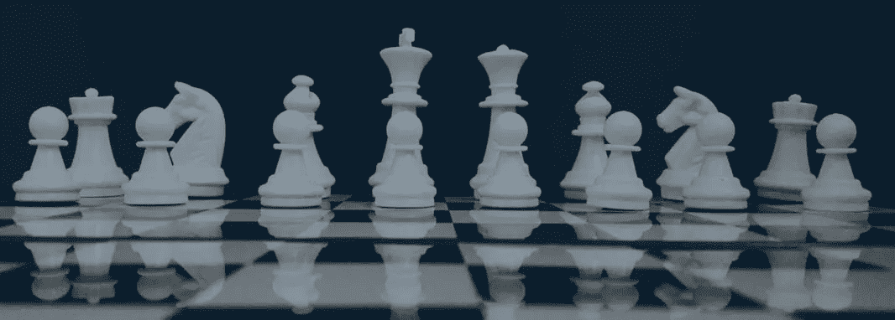
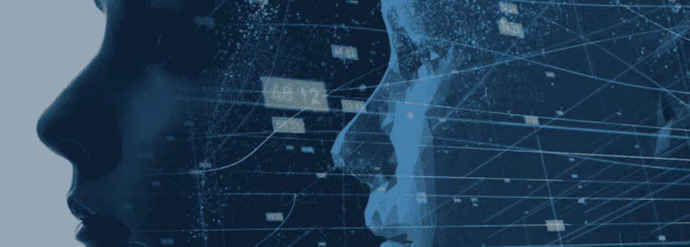
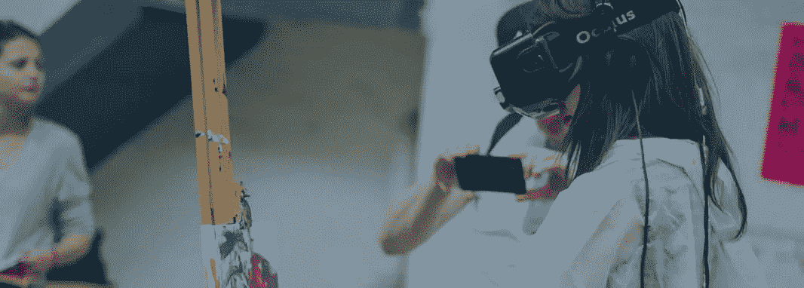

# Gartner 预测了 2019 年的顶级战略 IT 趋势[并介绍了 2018 年的技术预测，以检查他们是否击中要害]

> 原文：<https://medium.com/swlh/gartner-predicts-top-strategic-it-trends-for-2019-plus-19297ccab217>

随着每一年接近尾声，全球研究和咨询公司 [Gartner](https://www.gartner.com) 发布了一份年度战略技术趋势清单，他们预测这些趋势将塑造 2019 年的科技世界。

根据我们的经验，他们有令人印象深刻的命中率，但他们也不总是 100%准确。由于这是新的一年的开始，这似乎是一个完美的时间来回顾去年的预测，看看他们相信未来会发生什么。让我们开始吧。

# 2018 闪回:Gartner 的战略技术趋势

# 1.艾基金会

**他们是正确的吗？:**是的。

2018 年被广泛称为人工智能年，Gartner 不是唯一一个预测人工智能将起飞并开始看到主流采用的组织。诚然，我们仍处于人工智能的早期，但 2018 年见证了人们对人工智能和[的兴趣激增，全球支出达到令人印象深刻的 20 亿美元](https://towardsdatascience.com/15-artificial-intelligence-ai-stats-you-need-to-know-in-2018-b6c5eac958e5)。

# 2.智能应用和分析

他们是正确的吗？:是的。

这建立在最后一点上，因为智能应用和分析需要某种形式的人工智能来支持它们。Gartner 预测，我们将看到使用不引人注目的人工智能的应用数量增加，尽管很难确切说出有多少应用正在使用人工智能及其相关技术，但可以肯定的是，去年出现了爆炸式增长，并将继续下去。

# 3.智能事物

他们是正确的吗？:是的。

[Gartner 说](https://www.gartner.com/smarterwithgartner/gartner-top-10-strategic-technology-trends-for-2018/)，“有些智能的东西没有 AI 就不会存在，但有些是现有的东西(即相机)，AI 让它们变得智能(即智能相机)。这可以说是最容易验证的趋势，因为现在似乎几乎每个人都拥有一个谷歌主页或亚马逊回声。这还不包括智能汽车、恒温器、智能家居、冰箱等等。

# 4.数字双胞胎

他们是正确的吗？嗯……不完全是。

数字双胞胎本质上是现实世界系统的数字表示，例如实时显示交通数据并允许更智能决策的虚拟城市。我们已经朝着正确的方向迈出了步伐，但距离数字双胞胎所能提供的全部潜力还有很长的路要走。让我们看看 2019 年有什么。

# 5.云到边缘

他们是正确的吗？:差不多。

边缘计算是云计算的竞争对手，“在云计算中，信息处理、内容收集和交付离信息来源更近”。目标是改善延迟并减少连接问题。Gartner 预测，在 2018 年，我们将看到从云计算到边缘计算的广泛转移，尽管我们确实看到了这一方向的一些动向，但我们还没有完全实现。

# 6.对话平台

他们是正确的吗？:肯定。是的。

聊天机器人越来越受欢迎，而且不仅仅是在年轻一代中。当你将聊天机器人的使用量增加与家庭助理设备的兴起结合起来时，很明显 2018 年对话平台的数量大幅增加，这一趋势将在未来几年继续发展。

# 7.沉浸式体验

**他们是正确的吗？:**是的，在某种程度上。

增强现实(AR)、虚拟现实(VR)和混合现实(MR)都有助于推动人们对沉浸式体验的兴趣，应用程序开发人员也迅速跟上了这股潮流。我们还没有看到下一个 Pokémon Go，即使是最身临其境的体验也需要一些改进。尽管如此，毫无疑问，2018 年是 ar 和 VR 的好年景。

# 8.区块链

他们是正确的吗？:这是一个巨大的趋势！

评估区块链的吸收面临的挑战是，它通常位于引擎盖下，因此不太容易判断它是否被使用(除非该公司透露他们的解决方案背后有区块链支持)。尽管如此，无论 2018 年是否是区块链之年，很明显这项技术将会继续存在，而且不仅仅是加密货币。它在从农业到银行和投资的任何行业都有巨大的潜力。

# 9.事件驱动的

他们是正确的吗？是的

这里的想法是理解某个状态何时发生了变化，比如完成了一个采购订单。2018 年，事件驱动的业务发展到了一个新的水平，这要归功于从 CRM 系统到基于人工智能的业务工具，这些工具可以识别人类分析师可能没有意识到的更微妙的状态变化。

# 10.持续的适应性风险和信任评估

他们是正确的吗？是的

[Gartner 说](https://www.gartner.com/smarterwithgartner/gartner-top-10-strategic-technology-trends-for-2018/)“持续自适应风险和信任评估(CARTA)支持实时、基于风险和信任的决策，并对支持安全的数字业务做出自适应响应。虽然不是每个人都在船上，但由于我们正在创建的大量数据，2018 年在这个方向上发生了巨大的转变。

# 2019 战略技术趋势

# 1.自主的事物

我们同意吗？是的

Gartner 解释说，自主事物使用人工智能来执行传统上由人类完成的任务，它们可以分为机器人，车辆，无人机，电器或代理。即使一个类别在 2019 年没有起飞，你也可以打赌其他四个类别会起飞。

# 2.增强分析

**我们同意吗？是的**

Gartner 预测，到 2020 年，超过 40%的数据科学任务将实现自动化。这是有意义的，因为我们已经淹没在数据中，技术可能是我们需要的工具，为我们提供一个漂浮设备。人工智能可以更快地处理更多数据，还可以识别人类可能错过的见解。

# 3.人工智能驱动的开发

**我们同意吗？:**嗯，不是 2019 年，是快了。

人工智能已经被用来写音乐和新闻文章，因此在不久的将来它也将被用于软件开发。我们认为 2019 年可能有点乐观，但我们确实认为这只是时间问题。

# 4.数字双胞胎

我们同意吗？:可能是 2019 年，但更有可能是 2020 年。

Gartner 也预测了 2018 年的数字双胞胎，但我们还没有看到它们得到任何真正的主流采用。虽然我们很接近，但如果我们在 2019 年看不到真正的数字双胞胎，那么我们可以期待在 2020 年及以后看到他们。看好这个空间！

# 5.授权优势

我们同意吗？:是的。

基于 2018 年向边缘计算的缓慢但稳定的转变，Gartner 预测，2019 年将见证增强的边缘技术，“将把人们与数百种边缘设备连接起来”。如果他们说几百万，我们可能不会同意。事实上，我们正朝着正确的方向前进，在接下来的 12 个月内，我们似乎可以获得更大的优势。

# 6.沉浸式技术

我们同意吗？:是的。

这是 Gartner 在 2018 年报告中包括的另一个趋势，我们认为我们已经非常接近了。沉浸式技术已经存在，你可能已经体验过了，但我们可以期待它们在质量上继续变得更好，并在 2019 年见证越来越多的采用。这些是试图通过模拟世界来模仿真实世界的东西。Gartner 表示，到 2022 年， [70%的企业将会尝试沉浸式技术](https://www.gartner.com/smarterwithgartner/immersive-technologies-are-moving-closer-to-the-edge-of-artificial-intelligence/)。

# 7.区块链

我们同意吗？:是的。

区块链已经是一个巨大的趋势，无论我们能否直接衡量它的接受程度，很明显，它将在 2019 年及以后继续成为一个热门话题。因为这项技术是如此的新，很可能今年我们将开始看到区块链的创新应用，展示其真正的潜力。

# 8.智能空间

我们同意吗？是的

这是显而易见的。人们已经在使用智能恒温器等工具来帮助调节他们的生活环境，随着物联网的不断发展，我们将找到越来越多的方法来数字化我们的物理空间，并使用技术来管理我们的生活和工作环境。

# 9.数字伦理和隐私

**我们同意吗？:**肯定。

如果欧盟在 2018 年推出的《通用数据保护条例》(GDPR)教会了我们什么，那就是隐私和数据安全比以往任何时候都更重要。我们可以期待看到越来越多的关于我们的数据处理方式的讨论，以及监管机构和公众越来越多的监督。

# 10.量子计算

**我们同意吗？:**未来 3 到 5 年内不会。

“量子计算是一种基于亚原子粒子量子状态的非经典计算，” [Gartner 解释道](https://www.gartner.com/smarterwithgartner/gartner-top-10-strategic-technology-trends-for-2019/)。“经典计算机会以线性方式阅读图书馆中的每一本书，而量子计算机会同时阅读所有的书。量子计算机理论上能够同时进行数百万次计算。”这项技术已经存在，但我们预计量子计算机的商业化还需要一段时间。

# 下一步是什么？

如果你想在商业世界的竞争中保持领先，你需要关注最新的趋势，并了解它们会如何影响你的行业。Gartner 的趋势列表是一个很好的起点，但如果你想保持领先，你需要在今年剩下的时间里继续阅读和学习。这就是我们的切入点。嗯，阅读是好的，但做更好。

还需要帮助掌握新技术吗？没必要默默承受。在 Zfort 集团，我们做技术，所以你不必。因此，如果您准备与值得信赖的合作伙伴一起缩短产品上市时间，请务必[联系我们，了解更多信息！](https://www.zfort.com/#company/contacts)

最初发表于[zfort.com](https://www.zfort.com/blog/top-software-development-companies-eastern-europe/)

## 这篇文章发表在 [The Startup](https://medium.com/swlh) 上，这是 Medium 最大的创业刊物，有+421，678 人关注。

## 订阅接收[我们的头条新闻](https://growthsupply.com/the-startup-newsletter/)。

