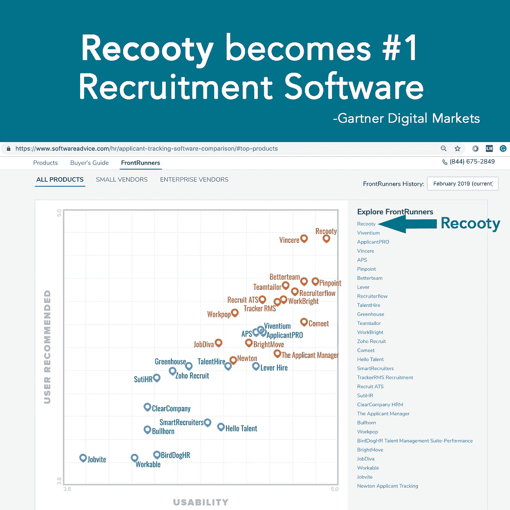

# Gartner Rate Recooty 排名第一的招聘软件供应商

> 原文：<https://medium.com/swlh/gartner-rate-recooty-no-1-recruitment-software-vendor-e25f3c99b221>

[***Recooty***](https://recooty.com/)*位居中小企业申请人跟踪系统排行榜前列* [*软件建议*](https://www.softwareadvice.com) *。*

*一个* ***申请人跟踪系统*** *是一个软件，其基本功能是以电子方式自动化多个工作公告板上的职位发布、筛选申请、入围名单、面试安排和雇用流程。*

为了创建这份报告， **Software Advice** 对 **320** 申请人跟踪系统(ATS)进行了评估。只有那些在**可用性**和**用户推荐**上得分最高的人才能入围。

在 Software Advice 于 2019 年审查的所有**全球招聘软件**产品中， **Recooty** 获得了最高的 4.9 分(满分 5 分)，并根据经过验证的用户评论和评级，成为了 clear 招聘申请人跟踪系统的市场领导者。供应商包括**reco coy**、 **Workable** 、 **Taleo** 等等。

## **什么是 Recooty？**

发布工作，审查申请，候选人名单，安排面试和雇用都在一个地方- Recooty。

Recooty 是一个一体化的招聘工具(ATS ),帮助中小型企业建立他们的优秀团队。它从最初阶段就优化了招聘，并简化到招聘流程的最后阶段。

## **Recooty 是如何成为全球中小型企业招聘软件领导者的？**

Recooty 因其简单性而成为全球领导者，该工具极其容易且非常实惠。使用该工具，您可以在几分钟内开始发布工作，跟踪申请人并轻松获得优秀人才。

> 招聘应该是容易和负担得起的，每个组织都应该有一个更好的团队来实现他们的目标。reco ooty 的联合创始人 Avdhesh 说:“我们在 reco ooty 的使命是帮助中小企业建立他们的优秀团队。”。

**在这里浏览完整的领跑者报告:**

 [## 顶级申请人跟踪系统- 2019 年评论和定价

### 阅读最佳申请人跟踪系统和候选人跟踪软件的评论。找到适合您的 ATS

www.softwareadvice.com](https://www.softwareadvice.com/hr/applicant-tracking-software-comparison/#top-products) 

**关于软件的建议:**

软件建议是为企业导航软件选择过程的领先在线服务。顾问提供免费的个性化软件推荐，帮助各种规模的公司找到满足其业务需求的产品。软件建议还包括行业专家的客观研究和经过验证的用户的评论，从而节省购买者的时间和资源。

软件咨询公司是一家 Gartner 公司。

*欲了解更多信息，请访问:*

www.softwareadvice.com

## 这篇文章发表在[《创业](https://medium.com/swlh)》上，这是 Medium 最大的创业刊物，有+435，678 人关注。

## 在这里订阅接收[我们的头条新闻](https://growthsupply.com/the-startup-newsletter/)。

