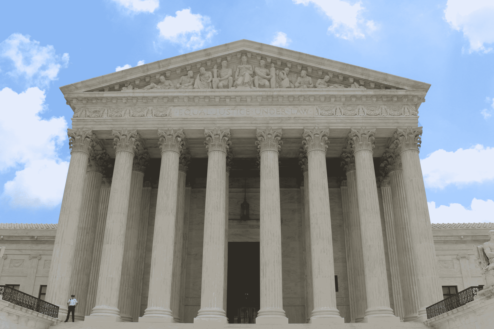

# GDPR 对数据科学的影响

> 原文：<https://medium.com/swlh/gdpr-implications-for-data-science-9c08b15b26ef>

《通用数据保护条例》(简称“GDPR”)于 2018 年 5 月 25 日生效，为个人隐私和数据保护设定了新的全球标准。加州在 2018 年颁布了类似的立法，2018 年的《加州消费者隐私法》规定了加州居民的数据权利，并于 2020 年 1 月 1 日生效。科罗拉多州还颁布了 HB1128，于 2018 年 9 月 1 日生效，该法案提供了具体的…