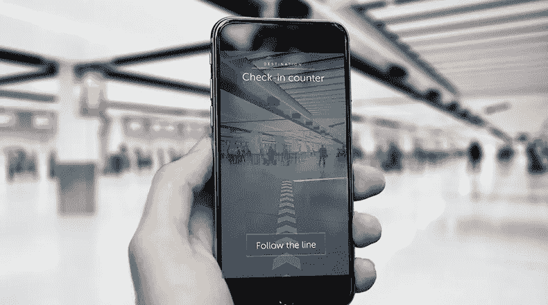
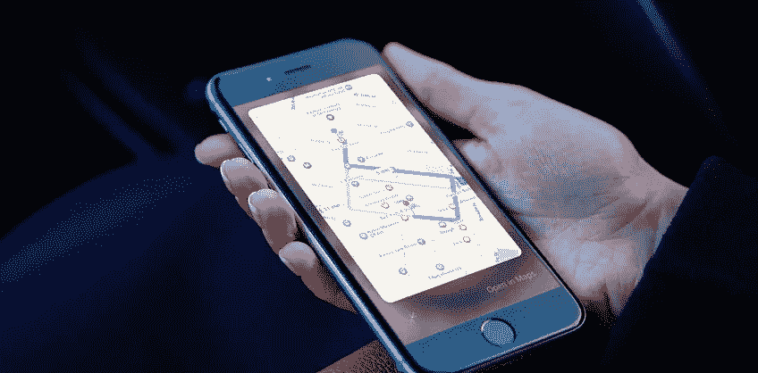
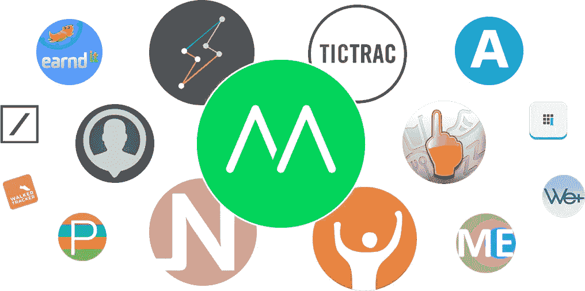
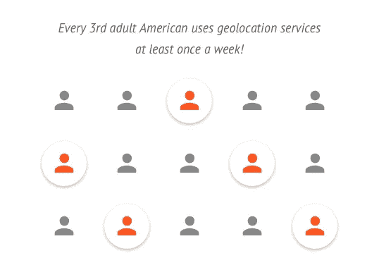

# 移动应用中的地理定位——一种提供最具互动性的用户体验的方式

> 原文：<https://medium.com/swlh/geolocation-in-a-mobile-app-a-way-to-provide-the-most-interactive-user-experience-721713eb6cf2>

随着智能手机背后技术的快速发展，地理定位已经成为移动用户体验的重要部分。它允许人们与他们周围的世界互动，在附近找到他们问题的解决方案，并提供最直接的用户体验。地理定位应用是融合数字世界和现实世界的门户，其受欢迎程度正在稳步上升。

这项技术为你的应用程序能做什么，以何种方式帮助用户提供了广阔的机会。在过去的十年中，由于这项技术的巧妙和创新的实施，一系列的初创公司出现了，并获得了丰厚的市场份额。它提供什么样的好处？你如何将项目货币化？在这篇文章中，我们仔细研究了移动市场中的地理定位。

# 那么我们现在看到的是什么样的应用呢？

# 导航应用

*例子:* Waze，Maps4Me，MapQuest

使用这个特性的一个最明显的方法是**帮助用户找到去未知地点的路**。这些应用程序可用于步行、骑自行车或开车旅行。他们可能还会建议使用公共交通工具，修建能够避免交通堵塞的路线**。**

# 社交应用

*例子:*班卓琴，脸书

我们也不能忽略社交应用，因为它们代表了市场的重要部分。他们与当地的人们取得联系，并讨论基于位置的内容。为用户提供与他们相关的最新信息是吸引和保持受众的一个好方法。

# 网络和约会

*示例:* Hppn、Tinder、Bumble

这些应用程序用于查找您所在位置附近您可能感兴趣的特定人员，并确保您的兴趣足够相似。剩下的就看你自己了——联系并安排一次会面！内置信使通常是项目的一部分。

# 天气预报

*例子:*天气频道，AccuWeather

每个移动用户都喜欢应用程序的简单性。如果可以自动确定具体位置，为什么要让一个人去搜索呢？即时提供设备所在地的天气预报，并让人们每天使用该应用程序。这是建立忠实观众的好方法！

# 健康和健身应用

*举例:*招式，跑垒员

这些应用程序通常会跟踪您一整天的活动，并提供一个概览来帮助您保持跟踪。它可以计算你走了多少步，或者记录慢跑的数据。你也可以和朋友分享你跑步的轨迹并炫耀——这是提高你动力的有效方法！

# 生活方式和爱好

*例子*:兴趣者

这些应用程序帮助你在当地找到有共同兴趣(爱好、运动等)的志趣相投的人。和朋友一起做好玩多了！这个项目的目的是帮助人们通过参加小组活动来保持联系和动力。

# 推荐应用

*例子:* Foursquare，Yelp。

在密集的城市环境中，信息是丰富的，商业也是如此——然而找到您需要的确切位置可能是一个挑战。这就是**推荐和评论应用**真正大放异彩的地方。广告总是为潜在客户描绘出一幅令人愉快的画面，而应用程序提供了那些实际上有过具体业务工作经验的人所急需的批判性观点。

更多地了解附近的公司有助于人们做出明智的决定。人工智能领域的最新成就允许检测虚假评论并将其数量降至最低。

# 旅游应用

*例子:*猫途鹰，Airbnb

地理定位发挥重要作用的另一个领域是**旅游应用**领域。他们专注于目前正在出差或旅游的人们的需求，并需要在旅途中解决某些问题(住宿是最明显的例子)。延误可能会造成不便，甚至毁掉计划。考虑到游客可能不知道他所访问的国家的语言，不足以与当地人交流，这实际上非常有帮助。

# 按需服务应用

*例子:*优步，弗利齐特

特定的企业可以使用本文范围内的移动应用程序在市场上推销自己，或者为特定的行业创建一个在线市场。该范围包括按需服务，如**出租车**、**清洁**等。在这种情况下，该项目通过吸引新客户或提高现有客户群的忠诚度来提供收入。

# 电子商务

*例子:*全球速卖通团购网

电子商务应用在这个细分市场的重要性怎么估计都不为过。这是塑造数字世界并使交易变得更加容易的主要因素之一。用户希望尽快拿到他们支付的任何东西**，提供当地市场的在线访问将商家和客户之间的互动带到了一个全新的水平。国际贸易也从这些项目中受益，因为它们可以很容易地计算出税额。**

# **活动应用**

***示例:* Plancast**

**我们正在寻找的应用程序可以帮助用户找到他们附近的事件，并参与当地令人兴奋的活动。一些项目还提供网上订票的可能性。活跃的社区成员也有机会组织聚会并接触到广泛的受众！**

# **当地专家和实时知识**

***举例:这里是 Biz，Bizzy***

**有没有想过如何找到你所在领域特定问题的解决方案？最好的方法是问一个真正了解这个主题的人——这正是这些应用程序的目的。他们根据用户的位置提供专家建议。**

# **各种各样的可能性**

**这并不是该技术可能用途的完整列表——随着市场上每天都有新项目出现，它的范围肯定要广得多。**

****

**上面描述的方法并不是盈利的唯一途径。如果有一个人们日常使用的**应用**(例如，查看天气预报)，产品所有者可以通过**向观众显示相关广告**来获得收入。这是可靠的收入来源，可以维持项目并投资于项目开发。**

**地理定位应用多种多样——这种技术几乎在现代市场的每个领域都有应用。该解决方案的实现各不相同，需要专业知识才能将其无缝集成到特定领域。Octodev 团队的专家们将会让这一切成为现实。如需更多信息，请随时联系我们！**

# **地理定位背后的技术**

**你的设备如何确定你此刻的位置？地理定位算法的核心是广为人知的 **GPS** 技术。通过读取来自卫星的信号，民用级设备将确定你的位置，精确度约为 50 米，这在人口稠密的城市地区是不够的。幸运的是，还有其他方法可以增强定位能力:**

*   **来自**蜂窝塔**的信号与上述技术结合使用，以提高结果。**
*   ****WiFi 接入点**也有助于这一过程——信号强度用于确定您离某个设施有多远。数百个路由器散布在城市各处，这是非常有用和可靠的。**

**有了所有这些解决方案，应用程序可以以 2 米的精度跟踪你的位置。然后使用特殊的工具包将坐标放置在地图上，并显示给用户或进一步处理。**

****

**对于这类应用来说，精确度是一个至关重要的因素，因为它必须在随用户移动的设备上正常工作(用户可能正在开车)，每秒钟都需要精确计算位置。这意味着，在基于位置的应用程序开发中，性能不会受到影响。这需要一个**熟练的团队**来完成任务，并交付一个将真正帮助用户的应用，这个应用将在市场上具有**真正的价值**。**

**在 Octodev，代码质量是我们业务的基石。我们尽最大努力创建一个**可靠的**解决方案，并且我们知道如何优化算法。我们将帮助您创建一个**有用的**和**健壮的**应用程序，它可以在繁重的工作负载下完美地工作。**

# **安全问题以及如何处理它们**

**请记住，用户根据自己的判断透露他们的位置，并且遵循全球安全偏执狂，他们中的许多人会对共享个人信息感到焦虑。这意味着用户**应该得到一些实实在在的价值**,作为他决定放弃某部分隐私的回报。**

**这也意味着应该在应用程序中实现某些安全措施，以避免数据泄漏。您不想暴露您的用户，即使是一个小的违规也会导致重大的声誉问题。应用程序应由了解可能的威胁和攻击媒介并能降低风险的可靠团队开发。在项目投放市场之前，应进行全面的测试。质量保证在消除故障几率和确保稳定性能方面发挥着至关重要的作用。**

**如果你想开发一个地理定位应用，Octodev 团队会很乐意帮助你。请[今天就联系我们](https://octodev.net/contact-us/)开始你的下一个项目！**

***本文原载于* [*Octodev 博客*](https://octodev.net/blog/) *。***

**如果你喜欢这篇文章，请点击下面的拍手图标告诉我！**

****

## **这篇文章发表在 [The Startup](https://medium.com/swlh) 上，这是 Medium 最大的创业刊物，拥有+432，678 名读者。**

## **在这里订阅接收[我们的头条新闻](https://growthsupply.com/the-startup-newsletter/)。**

****