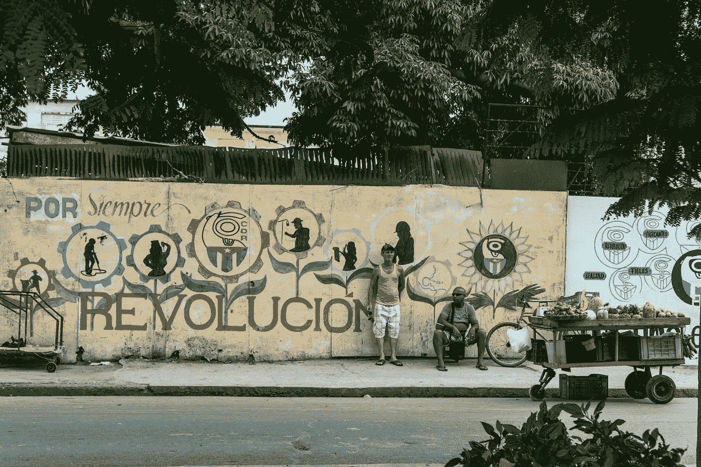

# 乔治·奥威尔与反法西斯斗争

> 原文：<https://medium.com/swlh/george-orwell-and-the-fight-against-fascism-7d85f597fdea>

Photo by [Guille Álvarez](https://unsplash.com/@guillealvarez?utm_source=unsplash&utm_medium=referral&utm_content=creditCopyText) on [Unsplash](https://unsplash.com/search/photos/revolution?utm_source=unsplash&utm_medium=referral&utm_content=creditCopyText)

在经历了斯大林默许佛朗哥和希特勒之后，乔治·奥威尔不再相信工人阶级革命是可能的，但他曾经为革命冒过生命危险。

1937 年 5 月 20 日，乔治·奥威尔作为 P.O.U.M(“马克思主义工人民兵组织”)的一员抗击西班牙法西斯佛朗哥时，喉咙中了一枪。