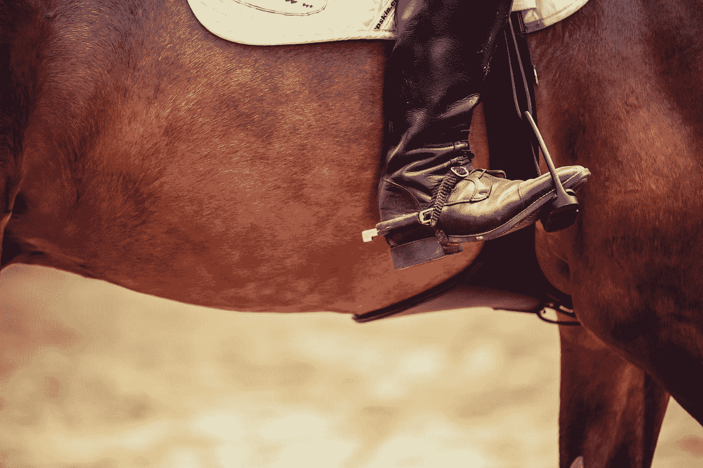

# 回到马背上！

> 原文：<https://medium.com/swlh/get-back-on-the-horse-4f3214ef08b4>

我从 20 多年的骑马生涯中学到的 5 条人生经验

Photo by [Markus Spiske](https://unsplash.com/@markusspiske?utm_source=medium&utm_medium=referral) on [Unsplash](https://unsplash.com?utm_source=medium&utm_medium=referral)

我从 4 岁开始骑马。我想骑的那个骑行项目直到孩子 5 岁才开始教他们。

我尽可能每天都去马厩。我恳求学习如何骑马。*我没有恐惧。*我一点也不害怕，当我走过去抚摸一匹以好斗闻名的马时，它…