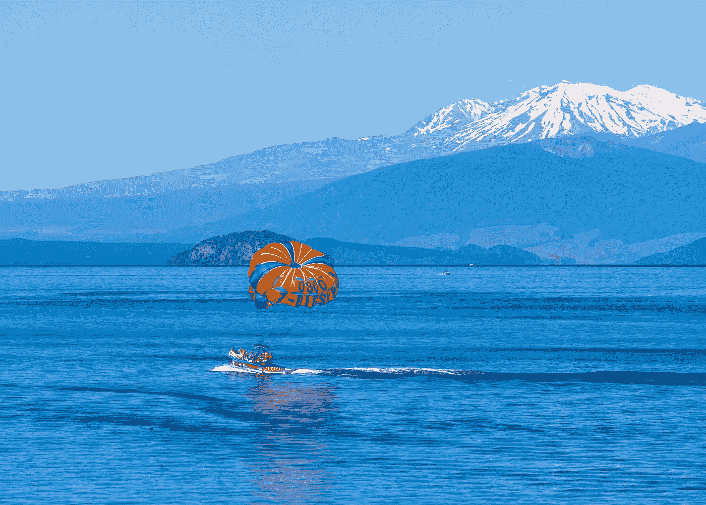

# 跳伞、滑雪、骑马:昂贵爱好的经济效益

> 原文：<https://medium.com/swlh/get-out-your-parachute-the-financial-and-personal-benefits-of-expensive-hobbies-81a42a16a715>

## 即使是昂贵的爱好也会对你有利

Photo by [Holger Link](https://unsplash.com/photos/0Nb8MQG00XE?utm_source=unsplash&utm_medium=referral&utm_content=creditCopyText)

没有哈佛学历？开始跳伞。

事实是，从事昂贵的爱好确实有好处。环顾四周——当一些人为他们昂贵的爱好付出高昂代价时，另一些人却在做他们的…