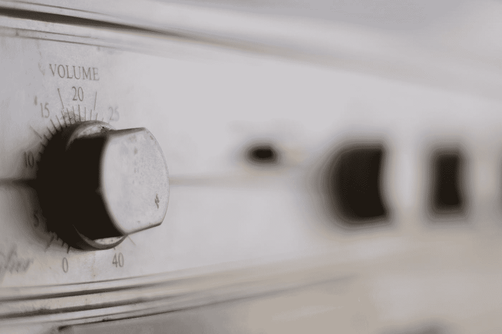

# 消除播客录制中令人讨厌的嘶嘶声

> 原文：<https://medium.com/swlh/get-rid-of-the-annoying-hiss-on-your-podcast-recording-a9e00c9a0ea2>

Photo by [Joël in 't Veld](https://unsplash.com/@joelvalentijn?utm_source=medium&utm_medium=referral) on [Unsplash](https://unsplash.com?utm_source=medium&utm_medium=referral)

你刚向你迷人的客人道谢，他说不客气。这是一次有趣的采访。你按下停止按钮，录音停止。客人走后，你再听一遍，看看你的问题是否严密。你按下播放键，你听到的第一件事就是一声嘶嘶声。

录音中反复出现的静电噪音是由一个或多个…