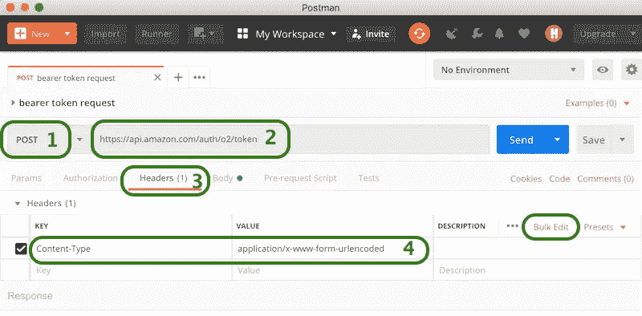
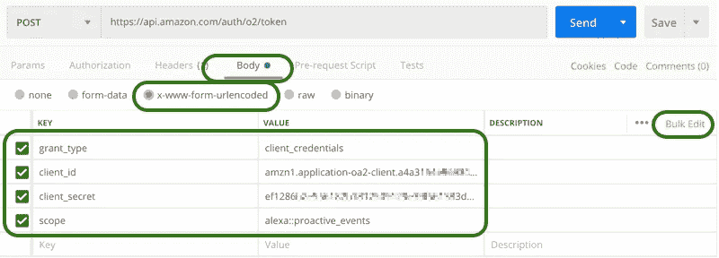
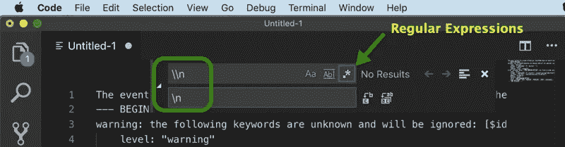

# 亚马逊 Alexa 技能主动事件 API 入门

> 原文：<https://medium.com/swlh/get-started-with-amazon-alexa-skills-proactive-events-api-5b082bcb282c>

亚马逊 Alexa Skills 是无服务器应用程序，允许人们通过语音或屏幕控制与支持 Alexa 的设备进行交互——语音和屏幕辅助。


Amazon Echo Dot

通常期望用户开始交互，触发 Alexa 技能对命令或问题做出响应。这样，用户可以决定何时开始交互。


Request-respond voice interaction

然而，在某些情况下，用户必须定期请求更新或新的信息。在这种情况下，由 Alexa 设备发起的通知可能更好。[主动事件 API](https://developer.amazon.com/docs/smapi/proactive-events-api.html) 提供了这个选项。

简短的[视频演示](https://www.youtube.com/watch?v=jjPqY_UZwlA)提供了关于 Alexa 和主动事件的快速介绍。

从主动事件 API 开始，我们需要创建一个简单的 Alexa 技能和 AWS Lambda 函数，它将在本文中用作游乐场。这篇[文章](/@sergeysmolnikov/create-simple-amazon-alexa-skill-with-backend-on-java-fcdbac05ed14)和[视频教程](https://www.youtube.com/watch?v=5rHIHUjuNRk)或许可以作为指南。

## 设置 ASK-CLI

安装 [ASK CLI](https://developer.amazon.com/docs/smapi/quick-start-alexa-skills-kit-command-line-interface.html#install-initialize) — Alexa Skills Kit 命令行工具。这是必要的，因为 Alexa 技能管理 API (SMAPI)用于设置，SMAPI 支持的一些功能在亚马逊开发者门户上不支持。*技能事件*功能就是其中之一，*它只能用 ASK CLI* 来管理，而不能用亚马逊开发者门户来管理。

```
sudo npm install -g ask-cli
```

*   初始化 ASK CLI。这将设置对 API 服务的访问。请在[使用 ASK CLI 管理凭据](https://developer.amazon.com/docs/smapi/manage-credentials-with-ask-cli.html)指南中找到更多详细信息。

```
ask init
```

在初始化过程中，会自动打开一个带有登录页面的浏览器。请按照[说明](https://developer.amazon.com/docs/smapi/set-up-credentials-for-an-amazon-web-services-account.html)填写要求的 AWS 访问密钥 ID 和 AWS 秘密访问密钥。

使用 *ask init* 的替代方法是使用管理员用户的 AWS 访问密钥 ID 和我们将使用的 AWS 秘密访问密钥来配置 [AWS CLI](https://developer.amazon.com/docs/smapi/quick-start-alexa-skills-kit-command-line-interface.html#install-initialize)

## 向技能添加事件

使用 ASK CLI 时，需要将[主动事件添加到](https://developer.amazon.com/docs/smapi/proactive-events-api.html#onboard-smapi)技能清单中。[选择一个或多个事件模式](https://developer.amazon.com/docs/smapi/schemas-for-proactive-events.html)作为通知发送(它们具有不同的有效载荷结构和属性)。事件模式列表定期扩展，[请为遗漏的模式和功能投票](https://alexa.uservoice.com/forums/906892-alexa-skills-developer-voice-and-vote/)。当前可用的事件模式:

```
[AMAZON.WeatherAlert.Activated](https://developer.amazon.com/docs/smapi/schemas-for-proactive-events.html#weather-alert)[AMAZON.SportsEvent.Updated](https://developer.amazon.com/docs/smapi/schemas-for-proactive-events.html#sports-event)[AMAZON.MessageAlert.Activated](https://developer.amazon.com/docs/smapi/schemas-for-proactive-events.html#message-alert)[AMAZON.OrderStatus.Updated](https://developer.amazon.com/docs/smapi/schemas-for-proactive-events.html#order-status)[AMAZON.Occasion.Updated](https://developer.amazon.com/docs/smapi/schemas-for-proactive-events.html#occasion)[AMAZON.TrashCollectionAlert.Activated](https://developer.amazon.com/docs/smapi/schemas-for-proactive-events.html#trash-collection-alert)[AMAZON.MediaContent.Available](https://developer.amazon.com/docs/smapi/schemas-for-proactive-events.html#media-content)[AMAZON.SocialGameInvite.Available](https://developer.amazon.com/docs/smapi/schemas-for-proactive-events.html#social-game-invite)
```

以 json 文件
`ask api get-skill -s skill_id > skill.json`的形式获取技能清单

在你最喜欢的文本编辑器中打开这个文件


向*清单*部分添加 *notification.write* 权限

```
"permissions": [{"name": "alexa::devices:all:notifications:write"}],
```

将选定的事件名称添加到*清单*部分。在这个例子中—选择了两个事件模式: *AMAZON。OrderStatus .更新了*和*亚马逊。可用的媒体内容*。将 Alexa Skill AWS Lambda 函数 ARN 放到端点属性中(关于端点和 Lambda 函数的更多细节在本指南的中)


仔细修改双引号字符，这些字符可能会被一些编辑器替换为类似的替代字符。

用正确的清单更新技能(将实际的 *skill_id* 放到命令中)

```
ask api update-skill -s skill_id -f skill.json
```

检查技能状态—如果更新正确，状态将包含*成功*

```
ask api get-skill-status -s skill_id
```


## 技能客户端 Id 和客户端密码

Alexa 技能的开发者控制台现在应该包含该技能的*客户端 Id* 和*客户端秘密*


打开一个 *Alexa* 手机应用( [iOS](https://itunes.apple.com/us/app/amazon-alexa/id944011620?mt=8) 、 [Android](https://play.google.com/store/apps/details?id=com.amazon.dee.app&hl=en) )或 [Alexa web-dashboard](https://alexa.amazon.com/) 。打开技能并启用它


Alexa 技能现在应该有一个部分*了，这个技能需要权限才能通过 *Alexa 通知*访问*


点击*设置*按钮，点击*管理权限*按钮


打开*开关*允许通知，点击*保存权限*按钮保存更改


现在拥有该技能的 Alexa 设备可以接收技能清单中指定的主动事件。事件可以由常规的 HTTP 客户端发送。比如: [Postman](https://www.getpostman.com/) 、 [cUrl](https://en.wikipedia.org/wiki/CURL) 、IntelliJ IDEA[“HTTP 客户端”——插件](https://www.jetbrains.com/help/idea/http-client-in-product-code-editor.html)等。

这是对[邮差](https://www.getpostman.com/)客户端的测试。

## 请求不记名令牌

在 *Postman* —点击一个“**+”**选项卡，添加一个新的*请求选项卡*，选择 *POST* 作为请求类型，输入不记名令牌 API URL

```
[https://api.amazon.com/auth/o2/token](https://api.amazon.com/auth/o2/token)
```

打开 Headers 选项卡，添加一个带有值的键 *Content-Type*

```
application/x-www-form-urlencoded
```



可选的*批量编辑*模式允许以文本形式填写键值对，*键值编辑*模式以表格形式填写键值对


打开 *Body* 选项卡，添加以下键值，选择选项 *x-www-form-urlencoded。*将实际*客户端 id* 和*客户端秘密*从*开发者控制台中取出，构建*选项卡*，权限*选项卡(如前所述)

```
Key:"grant_type"      Value:"client_credentials"
Key:"client_id"       Value:"amzn1.application-oa2-client.a478..."
Key:"client_secret"   Value:"ef1286b2..."
Key:"scope"           Value:"alexa::proactive_events"
```



注意:键*作用域*的值包含*双分号*，当设置批量/文本编辑模式的请求时，这可能会混淆一些 HTTP 客户端。

`{ "access_token”:”accessToken”, "expires_in":3600, "scope":"alexa::proactive_events", "token_type":"Bearer" }`

点击带有 *Pretty/JSON* 选项的 *Send* 按钮——查看响应，其中应该包含 *access_token*


该令牌将在 3600 秒后(一小时后)过期。在这段时间之后，新的请求将获得响应代码 403 ( *未授权* ) —需要请求新的令牌来继续进一步的请求。

这个不记名令牌应该伴随每个对事件 API 的请求。这个 API 有三个区域的独立端点，以及开发和生产环境。对于开发环境端点，事件不会发送给真实客户，而是用于测试目的:

*发展*
[https://api.amazonalexa.com/v1/proactiveEvents/**阶段/发展**](https://api.amazonalexa.com/v1/proactiveEvents/stages/development) *(北美)*
[https://api。**欧盟。**amazonalexa.com/v1/proactiveEvents/**阶段/发展**](https://api.eu.amazonalexa.com/v1/proactiveEvents/stages/development) *(欧洲)*
[https://api。**铁。**amazonalexa.com/v1/proactiveEvents/**发展阶段**](https://api.fe.amazonalexa.com/v1/proactiveEvents/stages/development) *(远东)*

*制作*
[https://api.amazonalexa.com/v1/proactiveEvents/](https://api.amazonalexa.com/v1/proactiveEvents/)*(北美)*
[https://api。**欧盟。**amazonalexa.com/v1/proactiveEvents/](https://api.eu.amazonalexa.com/v1/proactiveEvents/)*(欧洲)*
[https://api。**铁。**amazonalexa.com/v1/proactiveEvents/](https://api.fe.amazonalexa.com/v1/proactiveEvents/)*【远东】*

## 发送主动通知

在 *Postman* 应用程序中—点击另一个“**+”**选项卡以添加新的*请求选项卡*，选择 *POST* 作为请求类型，并输入开发事件 API URL

```
[https://api.amazonalexa.com/v1/proactiveEvents/**stages/development**](https://api.amazonalexa.com/v1/proactiveEvents/stages/development)
```

打开 Headers 选项卡，添加一个带有值的 key *Content-Type*

```
application/json
```

添加另一个带值的密钥*授权*

```
Bearer Atc|...
```

其中" *Atc|…"* 是来自先前接收的来自承载令牌 API 的响应的*访问令牌*属性的值。

注意:术语*持有者*和代币价值之间有一个空格。


打开 *Body* 选项卡，添加事件的 json-content，选中选项 *raw*

```
{
  . . .
   "event":  {
      "name": "**AMAZON.MediaContent.Available**",
     . . .
     "localizedAttributes": [
      {
        "locale": "en-US",
        "providerName": "**Alexa Events Example**",
        "contentName": "**Some event**"
      }
    ],
   "relevantAudience": {
    "type": "**Multicast**",
    "payload": {}
`   }
}
```


这个正文内容对应的是[亚马逊。MediaContent.Available](https://developer.amazon.com/docs/smapi/schemas-for-proactive-events.html#media-content) 模式，在本例中，媒体相关事件为:

"*Alexa Events Example*"("*providerName*")通知"*Some Events*"("*content name*")的新"*插曲* " (" *contentType* ")将通过" *air* "("方法")在 2019 年 6 月 8 日晚 8 点美国东部时间 " (" *开始时间*

*本通知将于“2019 年 6 月 8 日下午 2 *时*”(“*到期时间*”)到期。*

*点击*发送*按钮。如果承载令牌和事件内容正确，则响应代码将为 202 ( *接受*)，内容长度为零(无响应体)。打开 Alexa 设备会发出通知声音并开始闪烁。*

**

*要阅读通知，问“Alexa，我的通知是什么？”或者“Alexa，我错过了什么？”，此时收集的所有通知都将被宣布。*

*请注意，时间的发音不是针对 Alexa 设备时区的。我猜它对应于 API 区域或其配置的 AWS Lambda 函数，或者技能区域——我还没有确定地发现这一点。日期时间值应该采用 ISO 8601 格式，以“*Z*”(UTC)或时区转换周期结束*

```
*“startTime”: “2019–06–10T00:00:00Z
"startTime": "2019-06-10T05:00:00+05:00"*
```

*阅读通知后，它会在云中存档几个小时，然后自动删除。要阅读这些存档的通知——问 Alexa:“Alexa，我的*旧*通知是什么？”*

*可以用“Alexa，删除我所有的通知”命令删除通知。*

## *失败*

*如果请求有问题，响应代码将有 4 个**代码，响应正文将包含错误描述。此类问题的示例:*

*设置无效的“*到期时间*”。它应该是未来的至少 5 分钟，并且不超过当前时间之后的 24 小时:*

**

*设置的属性值无效，在事件架构中不受支持。查看“*消息*”值，其中包含与特定问题相关的信息。在值字符中" *\n* "可以替换为*换行符*，" *\* "可以替换为*双引号*，这样可读性更好。但是即使没有这样的修正，问题也是可以解决的*

**

*作为 Visual Studio 代码中的一个更正示例，字符可以替换为正则表达式选项。修复新行:*

**

*修复双引号*

**

*用 json-extension 保存修改后的文件会增加一些亮点*

**

## *活动受众选项*

*事件可以发送给所有特定技能用户(那些允许来自该技能的通知的用户)或特定用户，使用他们的*用户 id* 。属性“ *relevantAudience* ”用值“*多播*”和“*单播*”控制该选项。*

*向所有用户发送事件(广播或组播):*

```
*"relevantAudience": {
    "type": "**Multicast**",
    "payload": {}
   }*
```

*向特定用户发送事件:*

```
*"relevantAudience": {
    "type": "**Unicast**",
    "payload": { "user": "specific-user-Id"  }
   }*
```

*跟踪用户 id—订阅事件，通知用户打开/关闭主动通知。要使技能的 Lambda 函数接收此事件，请将以下订阅部分添加到 Alexa 技能清单中(添加到" *events* "属性中)，并使用 ASK-CLI 更新清单*

```
*"subscriptions": [
  {
    "eventName": "SKILL_PROACTIVE_SUBSCRIPTION_CHANGED"
  }
]*
```

**

*用正确的清单更新技能(将实际的 *skill_id* 放入命令中)*

```
*ask api update-skill -s skill_id -f skill.json*
```

*向 Alexa Skill AWS Lambda 函数添加一个请求处理程序来处理该事件(示例代码扩展了一个 Lambda 函数，在[本教程](/@sergeysmolnikov/create-simple-amazon-alexa-skill-with-backend-on-java-fcdbac05ed14)中创建)*

*将此处理程序的实例添加到 SkillStreamHandler 生成器中*

*构建 jar 文件并上传到 Lambda 函数。打开一个 Alexa 移动应用程序或 [Alexa web-dashboard](https://alexa.amazon.com/) ，打开技能，点击*设置*按钮，打开*打开*或关闭*关闭*开关*允许通知，点击*保存权限*按钮保存更改**

**

*在 CustomProactiveSubscriptionChangedRequestHandler 中订阅主动事件请求。请求正文包含“*订阅*”作为“事件名称”列表:*

```
*proactiveSubscriptionChangedRequest.getBody().getSubscriptions()*
```

*取消订阅 CustomProactiveSubscriptionChangedRequestHandler 中的主动事件请求。请求正文不存在*

```
*proactiveSubscriptionChangedRequest.getBody() == null*
```

*选择“*用户标识*和事件名称列表来管理单个通知*

```
*String userId = input.getRequestEnvelope().getContext().getSystem().getUser().getUserId();
//userId looks like "amzn1.ask.account.AFE2..."*
```

*并向特定用户发送通知，与“*单播*”“*相关受众**

```
*"relevantAudience": {
   "type": "Unicast",
   "payload": {"user": "amzn1.ask.account.AFE2..."}
 }*
```

## *可能的问题*

*尝试向不允许技能通知的特定用户发送通知—返回错误:*

*"*找不到任何 stage=development，skillId=amzn1.ask.skill.e2af…，topicId=AMAZON 的订阅。可用的媒体内容**

*在响应消息中:" *stage* "可以是" *development* "或" *live* "，对应的" *skillId* "和一个事件模式名，事件已经为其发送。*

**

*使用有效的*无记名令牌和*正确的*用户标识*向特定用户发出有关事件的请求时，可能会出现以下问题，但此无记名令牌与为其生成的用户标识的技能不同。也许这个问题还有其他原因。*

```
*{
 “type”: “Forbidden”,
 “message”: “No enablement for clientId: amzn1.application-oa2-client.d6ad..., userId: amzn1.ask.account.AFE...”
}*
```

**

*当用户禁用技能时，不会发送 ProactiveSubscriptionChanged 事件。当该用户再次启用该技能时，将为该用户分配一个新的用户 Id。因此，至少跟踪一个事件是有意义的。技能禁用”。还有关于激活/停用技能、启用/更改/禁用权限(包括接收主动通知的权限)的事件。为了让技能的 Lambda 函数接收这些事件，将下面的订阅部分添加到 Alexa 技能清单(添加到“*事件*”属性)中，并使用 ASK-CLI 更新清单*

```
*"subscriptions": [
  {
    "eventName": "SKILL_ENABLED"
  },
  {
    "eventName": "SKILL_DISABLED"
  },
  {
    "eventName": "SKILL_PERMISSION_ACCEPTED"
  },
  {
    "eventName": "SKILL_PERMISSION_CHANGED"
  }
]*
```

**

*RequestHandlers 类似于 CustomProactiveSubscriptionChangedRequestHandler——它们都实现带有名称的接口，对应于事件名称(例如*PermissionAcceptedRequestHandler*),在*默认*方法实现中有样板代码*

```
*@Override
**default boolean** canHandle(HandlerInput handlerInput) {
    **if** (handlerInput.getRequest() **instanceof** PermissionAcceptedRequest) {
        **return** canHandle(handlerInput, (PermissionAcceptedRequest)handlerInput.getRequest());
    }
    **return false**;
}

@Override
**default** Optional<Response> handle(HandlerInput handlerInput) {
    **return** handle(handlerInput, (PermissionAcceptedRequest)handlerInput.getRequest());
}*
```

*从技术上讲，来自这些处理程序的样板逻辑可以合并到一个处理程序中。*

*所有这些事件的最终技能表现如下*

**

*使用[代码](https://github.com/satr/aws-lambda-on-java-for-alexa-skill-proactive-events-api-example)构建 jar 文件并上传到 Lambda 函数，连接到 Alexa 技能。这个函数有一个预构建的[版本，带有 jar 文件](https://github.com/satr/aws-lambda-on-java-for-alexa-skill-proactive-events-api-example/releases/tag/1.0)。在 web-dashboard 的移动应用程序中启用/禁用技能和打开/关闭通知设置，并查看 Lambda 功能的云监控日志以查看活动。*

**

*[注意](https://developer.amazon.com/docs/smapi/proactive-events-api.html#event-format):事件可能会无序到达，使用事件中的时间戳来正确记录客户的最新订阅状态。*

## *语言和地区*

*为他们的后端创建 Alexa 技能和 Lambda 有不同地区的选项。AWS Lambda [应针对技能要求许可的每个地理区域进行配置](https://developer.amazon.com/docs/smarthome/send-events-to-the-alexa-event-gateway.html#endpoints)。例如，技能在美国和英国发送更改报告事件，则需要为北美和欧洲配置 AWS Lambdas。出于培训和评估目的，更容易为美国语言制作技能，为*n . Virginia*(*US-east-1*)地区制作 Lambda 函数。*

**

## *源代码*

*发布于 [GitHub](https://github.com/satr/aws-lambda-on-java-for-alexa-skill-proactive-events-api-example) 。用 jar 文件预构建[版本。](https://github.com/satr/aws-lambda-on-java-for-alexa-skill-proactive-events-api-example/releases/tag/1.0)*

## *参与 API 改进*

*你可以在 [Alexa 技能开发者论坛](https://alexa.uservoice.com/forums/906892-alexa-skills-developer-voice-and-vote/)上为功能和错过的事件类型投票。*

*本文作为[视频教程](https://www.youtube.com/watch?v=6Ul_ry2hq2w)。简单 Java ASK Proactive API 工具包[来源](https://github.com/satr/java-ask-proactive-api-kit)。*

**亚马逊网络服务和 AWS Lambda 是 Amazon.com 公司或其附属公司在美国和/或其他国家的商标。**