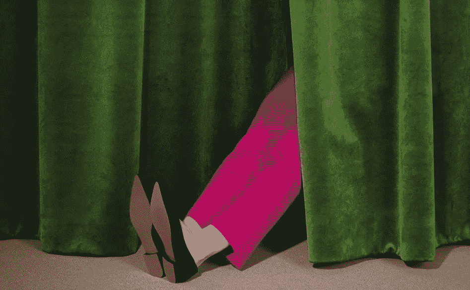

# 把文化搞对——其他一切都会水到渠成。

> 原文：<https://medium.com/swlh/get-the-culture-right-everything-else-follows-c161fb928f56>

Modern Designers for British Council, 2017\. Photo: Layla Sailor

啊，千禧一代。有太多事情需要回答。上周在曼彻斯特举行的一次早餐会上，情况大致如此，会上的话题围绕着如何为千禧一代的员工设计工作空间。毕竟，这一代人引领了办公室室内设计的潮流，在自然光和绿色植物、灵活的工作空间、令人惊叹的技术以及社交空间和项目方面都大有作为。