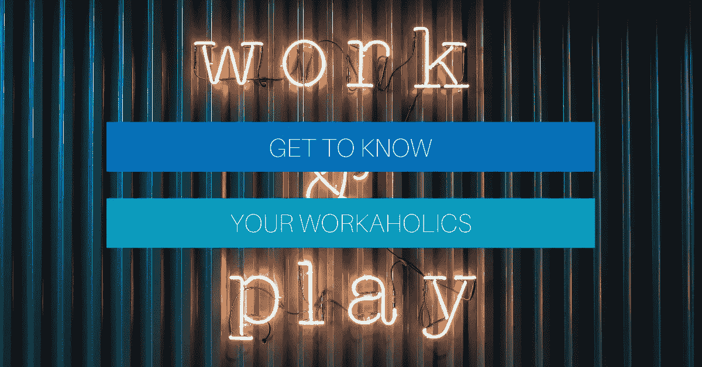

# 了解你的工作狂

> 原文：<https://medium.com/swlh/get-to-know-your-workaholics-364172ff7b36>

Photo by Antonio Gabola on Unsplash

大家好，我叫雷，我不是工作狂。我听到“你工作太多了！”，“你曾经睡觉吗？”虽然定期。我不认为工作狂这个头衔是定义我或我职业生涯中遇到的像我一样的人的正确标签。从外表上看，我可以理解为什么人们会认为长时间工作意味着你是一个工作狂。所以，我想给一些关于工作狂和工作狂之间的区别的见解…