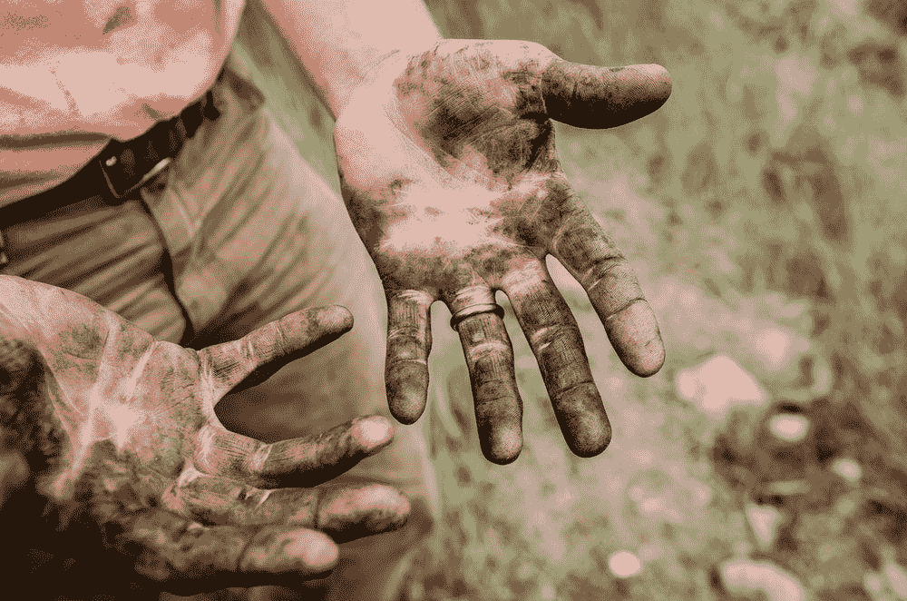

# 做体力工作

> 原文：<https://medium.com/swlh/get-your-hands-dirty-ec47e0c3b030>

## 个人发展不容易，但值得

Photo by [Jesse Orrico](https://unsplash.com/photos/IdjxBF_StBk?utm_source=unsplash&utm_medium=referral&utm_content=creditCopyText) on [Unsplash](https://unsplash.com/search/photos/effort?utm_source=unsplash&utm_medium=referral&utm_content=creditCopyText)

## 行动创造动力

我曾在个人发展方面指导过世界各地的人，我经常被问到，“这值得吗？”我的回答总是一样的，“如果你愿意为之努力的话。”

> 没有行动的计划只是一个梦想。