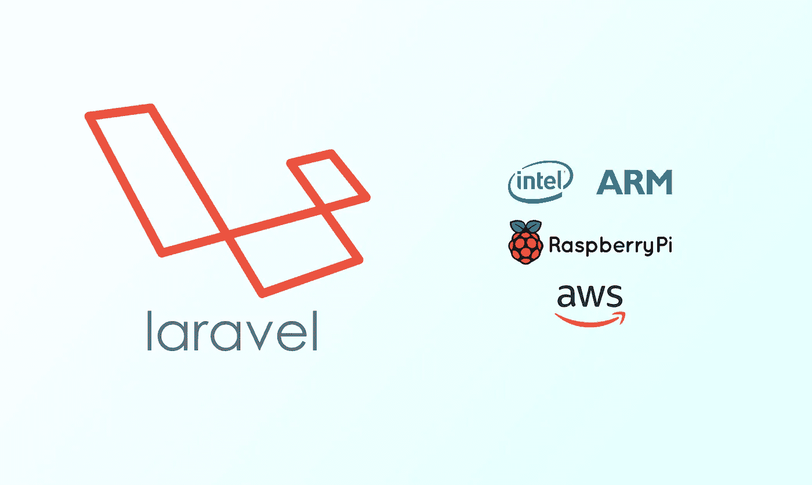

# 使用多架构 Docker 映像让您的 Laravel/PHP 应用程序在 ARM 和 x86 服务器上运行

> 原文：<https://medium.com/swlh/get-your-laravel-php-application-running-on-arm-and-x86-servers-using-multi-architecture-docker-16991f4f219e>

## docker 多架构映像入门

## 节省 40%,在 ARM 服务器上部署您的 Laravel 应用程序

# 动机