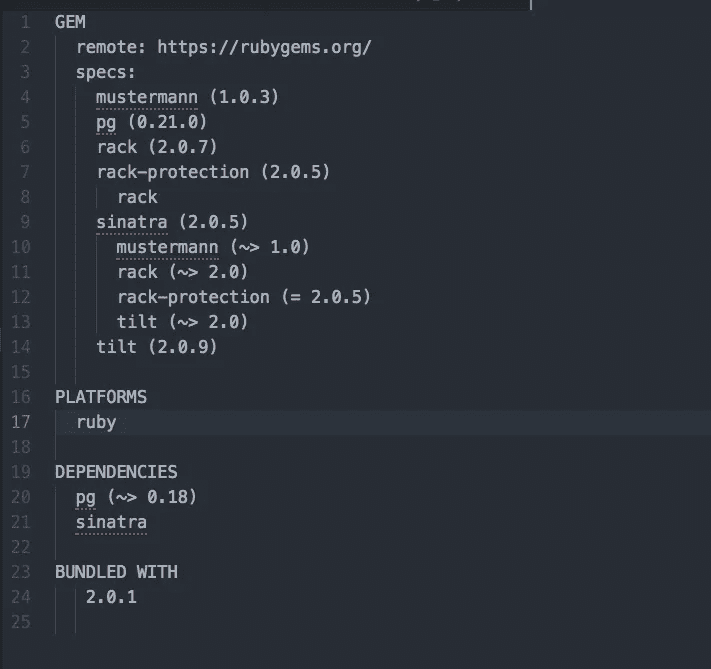

# 在 Heroku 上获取您的 Ruby-Sinatra 应用程序

> 原文：<https://medium.com/swlh/get-your-ruby-sinatra-app-on-heroku-47f1436cbf52>

我在 Heroku 上找不到任何关于启动 Ruby-Sinatra 应用程序的清晰指南，所以我决定写一个。

你需要做的第一步是创建一个 Heroku 账户。这是相当直接的，所以我不会进入它。

一旦你这样做了，你会想进入命令行并安装一个 bundler 和 heroku。首先是捆绑者:

`gem install bundler.`

然后安装 heroku:

```
brew install heroku/brew/heroku
```

然后，命令行会提示您登录 Heroku。一旦你完成了，你应该创建一个新的 Heroku 库。

```
heroku create
```


你的 Heroku 项目将被赋予一个随机的名字——Adj+geographic-Feature。如果你去> >[https://dashboard.heroku.com/apps](https://dashboard.heroku.com/apps)应该也能看到。


现在你已经设置好了，你需要在你的项目中添加几个文件来告诉 Heroku 如何运行它。您需要在命令行中接触 3 个新文件:config.ru | Procfile | Gemfile


我在我的 gem 文件中使用的唯一宝石是“pg”和“sinatra ”,所以我的 gem 文件看起来像这样。

```
source ‘https://rubygems.org'
gem ‘sinatra’gem ‘pg’, ‘~> 0.18’
```

congfig.ru 文件也很简单。看起来是这样的:

```
run Sinatra::Application
```

接下来是 Procfile。这给了 Heroku 运行你的应用程序所需的命令。这应该包括您在命令行中键入的命令，以便在本地运行您的应用程序。

```
web: bundle exec ruby app.rb -p $PORT
```

“app.rb”是我的主控制器文件，如果你的名字不是“app.rb ”,你需要修改它。

只差几步了。回到命令行，您需要进行捆绑安装来设置 Gemfile.lock。

```
bundle install
```


现在，您的文件夹中应该有一个 Gemfile.lock。它应该是这样的:



你现在可以发射到 Heroku！首先将所有文件添加、提交并推送到 github，然后使用以下命令推送到 Heroku:

```
git push heroku master
```

现在，你的应用程序可能不会在这一点上工作。您仍然需要设置您的数据库。进入你的 Heroku 仪表板::>点击资源::>点击 Heroku Postgres。


进入 postgres 数据库仪表板后，转到设置，然后点击“查看凭据”。


在这里，您将获得访问数据库所需的所有数据。将它们复制并粘贴到您的 sql runner 中，看起来应该是这样的。


一旦您完成了这些，您将需要在播种数据库之前创建一些表。您可以通过运行您的。Heroku 数据库中的 sql 文件夹。为此，您可以返回凭据并复制 Heroku CLI。


像这样运行您的 sql 文件。

```
<Your Heroku CLI> < db/<your_sql>.sql
```


然后，您可以为数据库设定种子:

```
Ruby db/seeds.rb
```

你就完了！…希望如此。