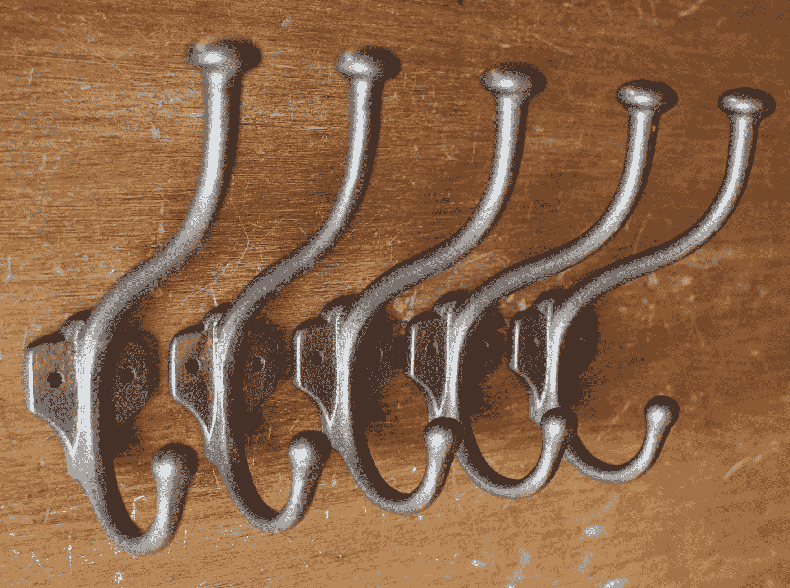

# 对 React 上瘾

> 原文：<https://medium.com/swlh/getting-hooked-on-react-f9c7e2558a15>

React 在他们的 16.8 版本中做了一个很大的声明，包括了钩子。它不仅标志着远离 React 类的范式转变，而且提供了一种更简化的创建组件的方式。然而，这并非没有学习曲线。热情的采纳者可以利用钩子进行创作；高阶组件(HOC)、可重用工具或上下文提供者。