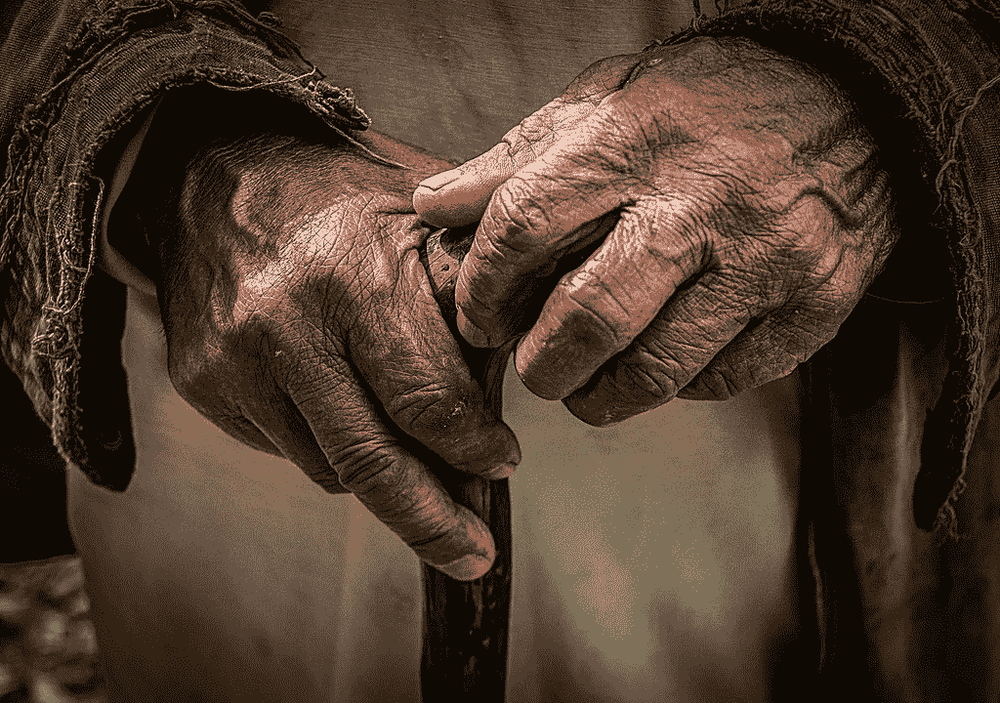
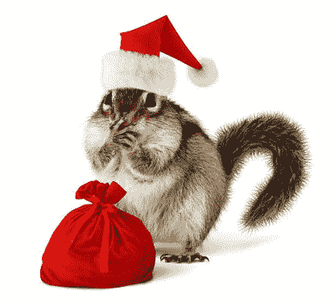
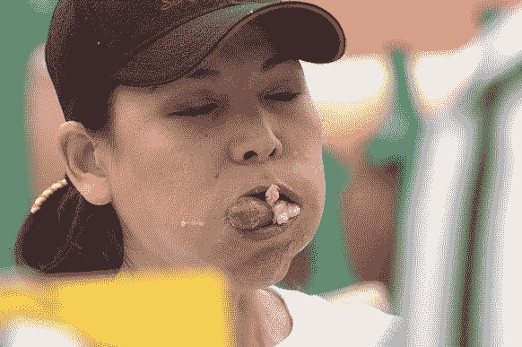
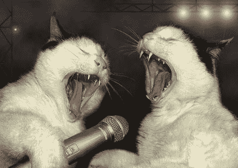
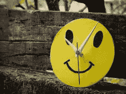

# 慢慢变老

> 原文：<https://medium.com/swlh/getting-old-slower-5b4c3c26e946>

我老了。

我知道我老了，因为我开始说老年人说的话。一些我曾经发誓永远不会说的话，比如“现在的年轻人！”以及“时间都去哪儿了？”

毫无疑问，随着我逐渐衰老，我的话语也随着我对世界不断变化的看法而变化。

(好吧，我是适度矫情。我可能还不到 30 岁。)

尽管如此，观察这些变化是很有趣的，并思考它们反映了我和我衰老的大脑。

一个似乎随着每年流行程度的增加而出现的主题是时间的明显加速。

小时候，日子常常过得很慢。成年后，周以惊人的速度飞快地过去了。作为一个孩子，圣诞节总是来得不够快。作为一个成年人，它似乎不断地(再次)到来。

前阵子听了一个讲座，讨论了这个现象。据称，我们对时间流逝快慢的体验更多的是我们对事件的**记忆**的作用，而不是我们当时对事件的直接体验。

因此，我们对一年过得有多快的回溯感可能与当时的感觉完全无关。

这就引出了一个问题。如果我们对时间节奏的总体感知是由记忆控制的，那么到底是什么让这些记忆让时间看起来快速而缓慢呢？

有一种理论认为，回想起来，时间是过得快还是过得慢取决于我们能从每个窗口记住多少。

假设我们回忆起某个特定时期的一大堆值得注意的事件。离开几个周末。一个或三个婚礼。海外旅行。一份新工作。去见莫莉·梅尔德隆。收养一只宠物鬣蜥。辣妹重聚演唱会。赢得吃热狗比赛。

为了解释发生了这么多事情，我们下意识地感觉到一定过去了很长时间。否则我们怎么能装下这么多东西(除了热狗)？

因此，我们认为这一时期是以一种更悠闲的方式过去的。

一旦我们明白了为什么我们的生命会飞逝，我们就可以寻找让它们慢下来的方法。

所以我们知道记忆与感知的时间流逝速度有关。我们知道突出的(不寻常的)东西在推动记忆形成方面特别成功。

因此，有理由认为，在我们的生活中加入更多不寻常的事件可能是减缓我们经历这些事件的速度的关键。

这样的变化不一定是剧烈的。我并不是建议我们明天都辞职去追求一个更随机的收入渠道。但是我们中的大多数人可能会比我们现在做的更多一点。

可能是一些简单的事情，比如偶尔去公园野餐，而不是在平常的餐桌上吃饭。在周末挥霍一些钱。参加随机的陶艺课程。尝试一个密室。开始寻宝游戏。在当地酒吧的卡拉 ok 之夜大声唱一首充满力量的歌谣。

当然——这比和网飞共度一个(另一个)夜晚要努力得多。但是记忆会持续更久！

> ***方案二:辅助编码过程***

在过去的 5 个月里，我一直在进行一个迷你实验(样本大小:我)。

为了帮助我的记忆，我已经收集了一份电子文档，记录了自从列出清单以来我生活中发生的所有特别的事情。

除了迫使我承认(并欣赏)每一件发生的事情，每次我打开清单添加新的东西，我都会想起过去的事情，否则这些事情可能会从记忆中消失。

令人着迷的是，这么长时间以来，时间第一次似乎慢了下来。

终于到了 7 月，感觉应该是 7 月了。

这一次，我确信圣诞节**不会在我知道之前到来。**

所以谁知道呢？也许你对生活的匆匆而过没什么意见。但是，如果像我一样，有时候你希望时间过得慢一点，为什么不开始列出你自己的突出时刻呢？

最坏的情况来临时，你可能会意识到生活实际上是多么伟大。

*原载于 2019 年 6 月 30 日*[*http://flitmusings.wordpress.com*](https://flitmusings.wordpress.com/2019/06/30/getting-old-slower)*。*