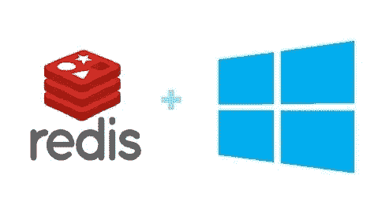

# Redis 集群入门

> 原文：<https://medium.com/swlh/getting-started-with-redis-cluster-on-windows-6435d0ffd87>

## Redis 是什么？

**Redis** 是开源的，BSD 许可的，高级的**键值**缓存和**存储**。它通常被称为**数据结构服务器**，因为键可以包含字符串、散列、列表、集合、排序集合、位图和超级日志。

## 什么是 Redis 集群？