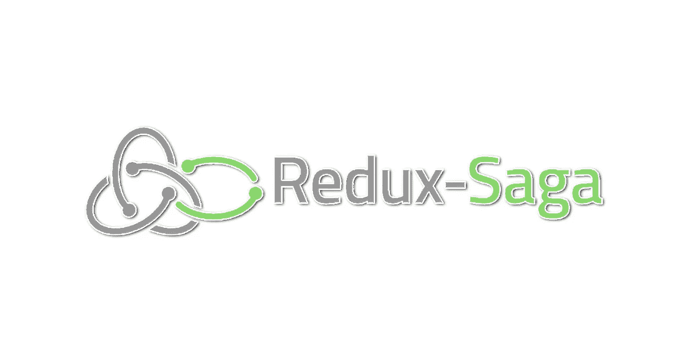

# Redux Saga 入门

> 原文：<https://medium.com/swlh/getting-started-with-redux-saga-af335e7e4893>

Redux saga 是一个 Redux 中间件，它使得应用程序的副作用更易于管理和测试。这些副作用用更简单的术语来说就是用于数据获取或访问浏览器缓存的 API，这些都是每个应用程序不可避免的重要部分。

我使用了另一个流行的中间件 Thunk 来处理这些副作用，它确实让我的生活变得简单了。从 thunk 切换到 saga 并不是…