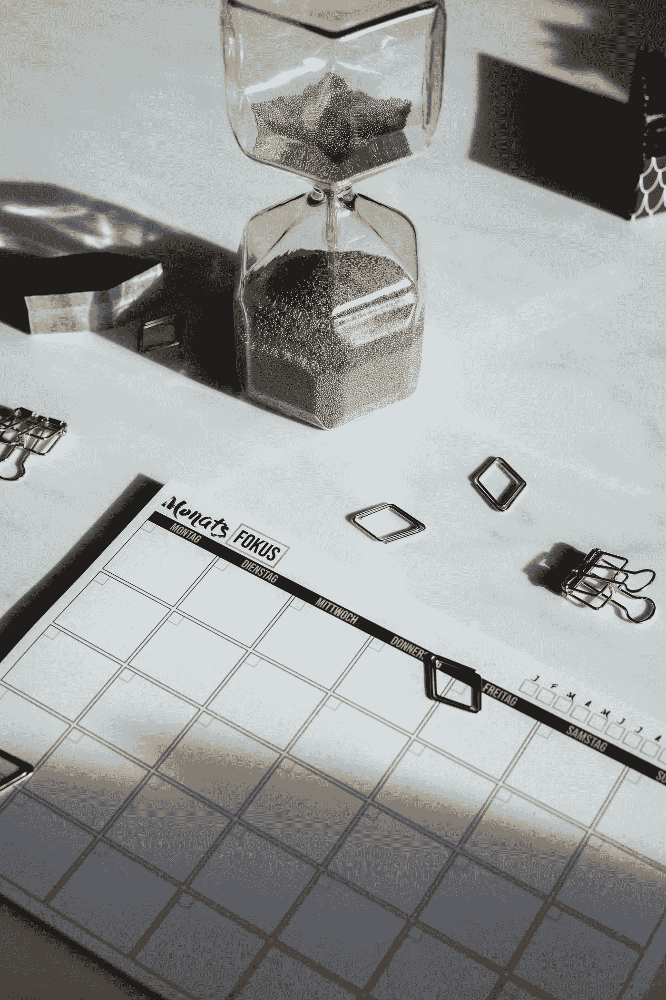

# 充分利用您的一天

> 原文：<https://medium.com/swlh/getting-the-most-out-of-your-day-703314e05f83>

有太多的想法和项目是我们梦想去做的。有些可能是更直接的计划，如在工作中启动一个项目，而另一些则是更长期的，如写一本书。在很多情况下，一天中似乎没有足够的时间。对我们时间的要求，包括工作和我们的个人责任，是如此之多。这经常会让人感到力不从心，然而有些人可以在有限的时间内做很多事情。

如果我们每天都有同样多的时间，那么提高效率的唯一方法就是更好地利用我们拥有的时间。效率来自于专注于最能给我们带来我们所寻求的结果的工作，以及尽可能好地组织你的时间。这不是一个关于如何最好地组织你的时间的策略的详尽列表，但是它们可以帮助你开始改善你可用时间的影响。

[Photo: Alexander Kaufmann/Unsplash]

# 安排时间的策略

## 1.时间块

根据你需要做的活动，把你的时间表分成几个时间段。你如何划分你的一天取决于你自己和你想做的工作的数量/类型。例如，你可以决定把一天分成相等的几部分。你可以有几个大的时间空间或许多小的时间空间。一旦你评估了这些时间段，你就可以选择适合你一天中不同时段的活动。随意试验:有时需要时间来找出什么活动在一天的什么时间最有效。

一个建议是做长期来看最重要的事情，或者在一天中最有效率的时候需要你最有创造力的事情。例如，对我来说，我最有效率的时间是早上，那时我的头脑是清醒的，为一天做好了准备。因为我正在写我的第一本书，而且我没有这种习惯，所以我早上做的第一件事就是写作。我知道一天中的那段时间是留给写作的，在完成配额之前，我不允许自己做任何其他事情。此外，其余时间的压力迫使我完成工作。

以时间段为单位制定你的时间表有很多好处。首先，因为你知道你要做什么和什么时候做，你的时间表是可预测的，你可以在任何时候轻松地想象你的一天。这种计划策略也节省了时间，因为你不必每天都建立一个时间表。

你也可以更容易地计划，因为你会有一个常规，知道什么时间最适合什么。你甚至可以创造空间来应对不可预知的事件。此外，当你向自己证明你制定的时间表是有效的，你就会有信心在你计划的时间内完成你为自己制定的任务。最后，每天的例行工作会帮助你很容易地看到你的时间表是否已满，或者是否有额外的空间给新项目。

## 2.每天补充一点点

出现是成功的一半。如果你正在做一个长期的项目，目标是继续做下去，每天都增加一点。

为了计算出要做多少，把你的项目分成更小的块，每天做一部分。随着时间的推移，工作的进展会越来越快。例如，如果你在写一本书，你可以设定一个目标，每周每天写多少字。

即使你每天的配额不是很高，你也会注意到随着时间的推移，结果开始增加。你只需要留出一点时间，坚持不懈地做某件事，直到完成。

我发现，一旦我开始着手一个起初看起来令人望而生畏的长期项目，我最终会超越我的每日或每周目标。我的工作变得更好，因为我在前进中获得了实践和信心。因此，我能够随着时间的推移提高我的成绩。

## 3.利用每一刻

利用一点点空闲时间，好好利用你拥有的时间。假设你在开会前有 15 分钟。这 15 分钟可能不足以让你一头扎进一个项目，但是对于回复你的邮件来说，这 15 分钟可能足够了。这样，你就在你的待办事项清单上勾掉了一个项目，你以后要做的任务也少了一个。

## 4.休息

休息至关重要。你不能不休息就连续工作一整天；你的身体会让你为此付出代价。只有当你睡了一整夜，并把时间留给你个人生活中喜欢做的事情时，你才会尽可能地富有成效。此外，白天小憩会让你精力充沛地去做工作中需要做的事情。

你会更聪明地工作，因为你的头脑会更清晰。你也将能够对你花费时间的任务做出更好的决定。及时安排休息时间；否则，根据我们今天的进度要求，项目将无法完成。

[Photo: Daniele Levis Pelusi/Unsplash]

## 5.早点出发

最后，我建议如果可以的话，早点开始新的一天。睡了一夜好觉后，我们往往在早上更有精力。此外，当这里比较安静，没有其他人可以打扰时，会有一种平和的感觉，有助于提高工作效率。你不仅可以更早开始新的一天，还可以更轻松地完成需要更多脑力的任务。然后，你需要沟通或处理不需要太多脑力的任务的时间将与团队其他成员全力工作的时间保持一致，干扰不会对你造成太大影响。