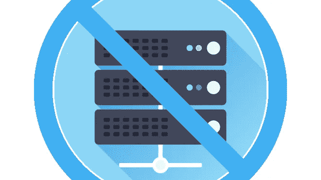

# 充分利用您的无服务器架构

> 原文：<https://medium.com/swlh/getting-the-most-out-of-your-serverless-architecture-157f092bead7>

无服务器(作为服务或 FaaS 的功能)不再是新的了。事实上，它正在成为软件开发领域越来越大的一部分。如果您是无服务器的新手，好消息是许多早期采用者在黑暗中摸索出了一条路，犯了错误并记录了最佳实践，我们都可以从中受益。

## 为什么选择无服务器