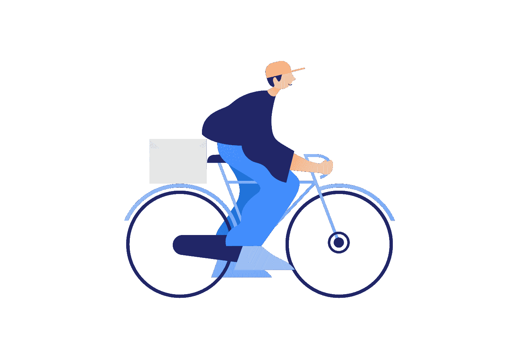

# 零工经济&工作的未来

> 原文：<https://medium.com/swlh/gig-economy-the-future-of-work-885354c39ad0>

illustration: [icons8.com](https://icons8.com/ouch)

躺在沙发上，我在笔记本电脑上工作。几分钟后，我发现自己在 Swiggy 上滚动浏览无限的食物选项。你可能使用过众多“食品科技”应用程序中的一个来搜索餐馆，在你最喜欢的酒吧预定座位。选择餐厅，应用折扣代码并下订单！送货员很快就到。他是技术驱动的便利行业中的人类纽带。他有…