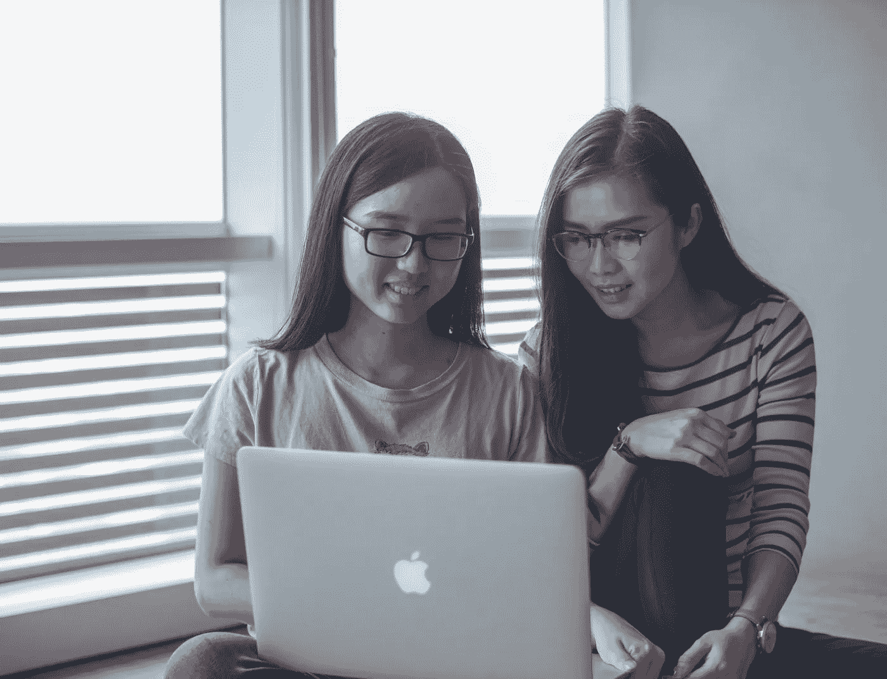

# “女孩就是不喜欢计算机科学”不是一个足够好的借口

> 原文：<https://medium.com/swlh/girls-just-dont-like-computer-science-isn-t-a-good-enough-excuse-d867d5121a91>

Photo by [Mimi Thian](https://unsplash.com/photos/gicQUPeAsxA?utm_source=unsplash&utm_medium=referral&utm_content=creditCopyText) on [Unsplash](https://unsplash.com/search/photos/girl-on-laptop?utm_source=unsplash&utm_medium=referral&utm_content=creditCopyText)

在英国，在科技行业工作的人中只有 17%是女性。

正如你所料，当谈到在学校学习计算机的女孩数量时，统计数据同样令人沮丧。

学习计算机科学 GCSE 课程的学生中只有 20%是女性。对于计算机科学 A-level 课程，这个数字下降到少得可怜的 7%。

结果([教育部](https://assets.publishing.service.gov.uk/government/uploads/system/uploads/attachment_data/file/676389/SFR03_2018_Main_text.pdf)报告)，只有 0.4%的女孩选择学习高级计算机科学——相比之下，男孩接近 5%。这意味着在一个计算机班里，每有一个女孩，就有超过 12 个男孩。

而且没有任何好转。尽管在过去的三十年里工作机会迅速增加，但是来自埃森哲和编程女孩的新的 T4 研究显示，科技领域的性别差距实际上已经恶化。

我经常听到的一种说法是，*‘女生不想学计算机科学’。*

我的问题是，*为什么？*

# **为什么科技行业缺少女性是一个问题**

在我们试图揭开这个问题的根源之前，我们首先需要承认这是一个问题。

## 了解技术是如何工作的会带来更多的机会

在当今世界，知道如何自己编程和构建东西会给你带来显著的优势。

当然，对于一个完全没有技术背景和零编码经验的人来说，构建一个成功的产品是可能的——但这将是困难的。

当然，你总是可以雇佣其他人来为你做这件事——但是依靠其他人来构建你的想法意味着你需要有资金或者愿意放弃你公司的股份。如果你试图通过雇佣低技能的开发人员来偷工减料，你可能会浪费很多钱，最终得到一个糟糕的产品。

知道如何编程并有信心这样做，是花几个月时间为你的下一个项目找到合适的技术合作创始人，还是今晚就能回家建立你的想法。

## 科技正成为社会越来越重要的一部分

即使你对制造自己的产品不感兴趣，很明显科技在我们的社会中扮演着越来越重要的角色。

人工智能已经彻底改变了就业市场，而这仅仅是开始。谁知道几十年后会发生多大的变化？

如果我们想确保这些变化是积极的，并改善每个人的生活质量，而不仅仅是一个选定的群体，我们需要确保技术背后的人尽可能多样化。

## 技能差距

我们目前正在经历科技行业内的[技能缺口](https://smallbiztrends.com/2018/04/tech-skills-gap.html)，每年有数千个职位空缺。

这个问题会变得更糟。

在一个只有 17%的技术人员是女性的时代，考虑她们填补自己角色的潜力是很合理的。

WISE 的 Wollaston 说:“技能短缺阻碍了业务增长，限制了创新，因为我们错过了女性可以带来的丰富创意。“女性正在错过令人兴奋的高薪职业。”

# 为什么女生会选择不上学校的计算机科学课？

Photo by [Tim Gouw](https://unsplash.com/photos/LmYcS4nwj8w?utm_source=unsplash&utm_medium=referral&utm_content=creditCopyText) on [Unsplash](https://unsplash.com/collections/2571880/teens-and-screen?utm_source=unsplash&utm_medium=referral&utm_content=creditCopyText)

*“女孩就是不喜欢计算机科学”*这不是一个足够好的理由。

现在是时候承认仍然有一些重大障碍阻止女孩在学校学习计算机，因此也阻止女性涉足科技行业——而“不喜欢计算机”不在其中。

事实上，女性在科技行业代表性不足的原因有很多:

## **缺乏可见的榜样**

许多成功的故事未能在更广泛的行业中曝光。

本周早些时候， [Reshma Saujani](https://medium.com/u/530615ef05ff?source=post_page-----d867d5121a91--------------------------------) 讨论了[在科技领域清除女性](https://onezero.medium.com/erasing-women-in-tech-how-60-minutes-ignored-womens-voices-stories-and-expertise-7ee8e157c262)的问题。

在这篇文章中，她提到了在 1946 年 ENIAC 的第一次演示中，第一台计算机(也称为 ENIAC)背后的女性甚至没有被提及；凯瑟琳·约翰逊，这位美国国家航空航天局的数学家，计算了美国第一次载人航天飞行的轨道轨迹，在这次飞行的报道中几乎没有提到，最近，一个关于女孩和计算机科学的新闻节目实际上没有提到一个关注女孩的组织*。*

*相反，该网络选择了一名男性——Code.org 的首席执行官，该公司参与了与特朗普政府合作的****)领导让更多女性进入科技行业的运动。*****

## ***课程需要彻底改革***

***即使学校教计算机，课程也是枯燥乏味的。没有人真正了解这门学科到底有多有趣，通常也没有动力去实际应用你所学到的东西。***

***没有人会通过记忆冒泡排序算法或从教科书中学习传输控制协议的定义，然后在考试中背诵来爱上计算机科学。***

***我们应该鼓励孩子们拓展他们的想象力，建造东西，解决有趣的挑战。***

***那时，也只有那时，我们才应该试图解释它背后的理论。***

***此外，计算机科学课程的教学方式可能对许多女孩没有吸引力。大量研究表明，女性倾向于喜欢团队工作，而男性喜欢独自工作。此外，小组工作有助于发展社交技能，并让学生练习在团队中工作——这是工作场所的一项重要技能。***

***因此，过渡到更多的基于项目的工作，包括与其他同学一起在小组中工作，可能会对所有学生产生积极的结果。***

## *****早年缺乏接触*****

***关于孩子的玩具是否会影响他们的职业选择，已经有很多研究。***

***女孩们玩洋娃娃和厨房用具。男孩们玩机器人和汽车。就是这么回事([*)…或者是？*](https://www.bbc.co.uk/news/av/magazine-40936719/gender-specific-toys-do-you-stereotype-children) *)。****

***因此，即使学校里的每个人都在相同的年龄开始编程，也经常会有这种根深蒂固的想法，即男孩“建造东西”和“说代码”的时间比女孩长得多。这可能会给人一种男生领先的感觉，并且在计算机科学课上可能会让女生感到害怕——即使她们以前有过经验。***

****“教室里有一种竞争的炫耀，让一些没有经验的女性望而生畏，”*计算机科学硕士候选人凯西·库珀在接受采访时说*。"甚至在入门课上，这些家伙看起来就像他们以前一直在编程."****

***由于这种明显的领先优势，再加上“计算机科学是男孩子的事”的刻板印象，许多成绩优异、非常能干的女性一开始就很努力，在初次考试中得分很低。他们中的许多人认为自己“不适合”这门学科，并对自己缺乏进步感到尴尬。***

***因此，可以理解的是，他们辞职了。***

***如果我们希望每个人在这个行业都有平等的成功机会，我们需要确保他们从一开始就处于平等的地位。***

## ***教师短缺***

***在英国，54%的学校不提供计算机科学 GCSE。***

***硅谷风险投资家弗雷德·威尔逊在他的博客上公开呼吁学校教授更多的计算机科学。***

****“我们继续教我们的孩子法语，但没有教他们 Ruby on Rails。你认为未来几年哪个对他们的帮助更大？”****

***但是如果没有足够的老师，我们就不能提供更多的计算机科学课程。英格兰只完成了 68%的计算机教师培训课程的招聘目标。***

***目前，政府每年仅拨款 120 万英镑用于培训现有的计算机教师。***

***英国皇家学会呼吁政府在未来五年投资 6000 万英镑，目标是培训 8000 名中学计算机教师。这将有助于使计算机教育经费与物理和数学同等重要。***

***然而，目前具有足够专业知识来教授技术学科的受训人员严重短缺。***

***如果我们希望激励我们的学生在学校学习计算机科学，我们需要尽一切努力找到优秀的、有吸引力的老师。***

***让更多的女孩了解这一主题是一个重要的起点，但我们需要的不止于此。我们需要积极鼓励女孩参与的人。我们需要更多的女性来充当榜样，提供灵感，并向孩子们展示这个领域是多么令人兴奋、有趣和有益。***

***最重要的是，我们这些人能够激发年轻女孩的信心，并向她们展示她们和男性一样自信。***

## ***对技术的先入之见***

***目前，在大多数学校，计算机并不被视为一门“酷”的学科。***

***如果我们想让更多的人——包括孩子和他们的父母——对此感兴趣，我们首先需要解决许多让人们远离这个话题的文化和社会陈规定型观念。***

***课堂外的榜样也很重要。对于一个 12 岁的女孩来说，与丹麦人艾达·丁(Ida Tin)建立关系要比她与马克·扎克伯格建立关系容易得多，艾达·丁是一个月经和排卵追踪系统的创始人。***

## ***如果我们想让更多的女孩参与科技，我们需要从小就鼓励她们***

***如果我们有希望让更多的女性参与到科技领域，更重要的是*充满热情*，我们需要认真改革我们目前的教育体系。***

***计算机科学已经处于我们经济的最前沿——而且在可预见的未来仍将如此。***

***如果我们想让我们的孩子处于平等的地位，我们需要现在就开始准备。***

# ***_***

***想要连接吗？你可以发电子邮件到 aimee.pearcy@gmail.com 给我😄 ✉️***

***否则，请鼓掌和分享，让我知道你喜欢这个帖子！👏 ⭐️ ❤️***

******

## ***这篇文章发表在[《创业](https://medium.com/swlh)》上，这是 Medium 最大的创业刊物，有+435，678 人关注。***

## ***在这里订阅接收[我们的头条新闻](https://growthsupply.com/the-startup-newsletter/)。***

******