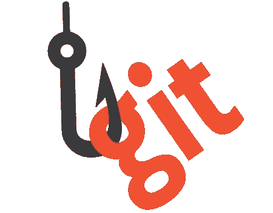

# Git 挂钩

> 原文：<https://medium.com/swlh/git-hooks-cc07908cd54>

有一天，我和一个同事聊天，他告诉我他参与的一个项目，在这个项目中，他不得不处理 git 钩子。他向我解释说，他的代码在推任何东西之前必须通过所有的测试，说实话，这让我很惊讶！

# 什么是 git 挂钩

我开始挖掘它，我做的第一件事就是寻找 git 钩子到底是什么: