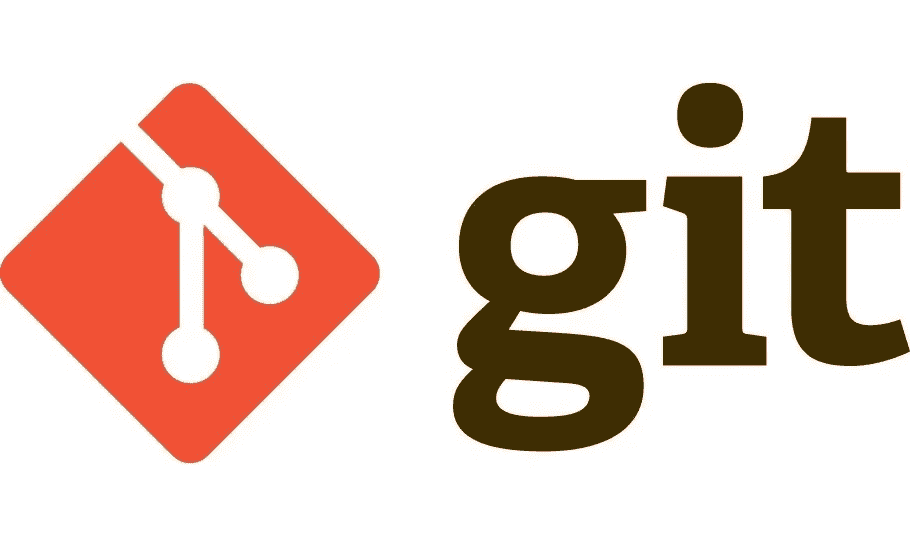

# Git 初学者手册

> 原文：<https://medium.com/swlh/git-manual-for-beginners-7932a6523d2f>

它是最流行的跟踪变更的分布式版本控制系统。如果你是软件开发世界的新人，你必须了解它，你必须使用它。我给你的建议是，如果你是一个软件开发领域的新手，试着用 GUI 工具如源码树来使用 git，对你来说第一步要容易得多，然后你可以用 Git 命令深入研究。但事实是 Git 只是一个命令行。