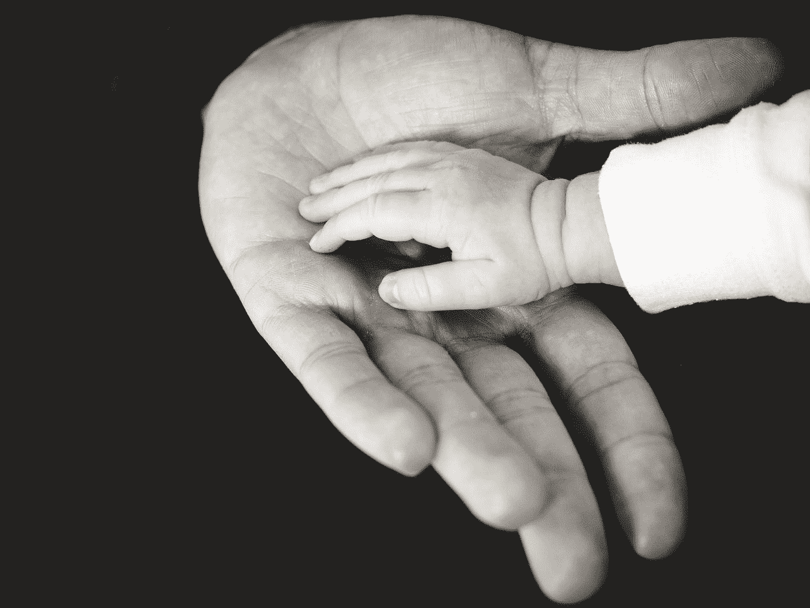

# 允许自己从小处着手

> 原文：<https://medium.com/swlh/give-yourself-the-permission-to-start-small-d3064c0e74b7>

## 大结局往往有小开始。这种情况比你意识到的要多得多。

Photo by [Liane Metzler](https://unsplash.com/@liane?utm_source=medium&utm_medium=referral) on [Unsplash](https://unsplash.com?utm_source=medium&utm_medium=referral)

有一些关于大的东西吸引着我们:大想法、大解决方案、大利润、大数据、大目标、大愿景、大突破…

我们都有远大的抱负，我们希望尽快实现。我们被…迷住了