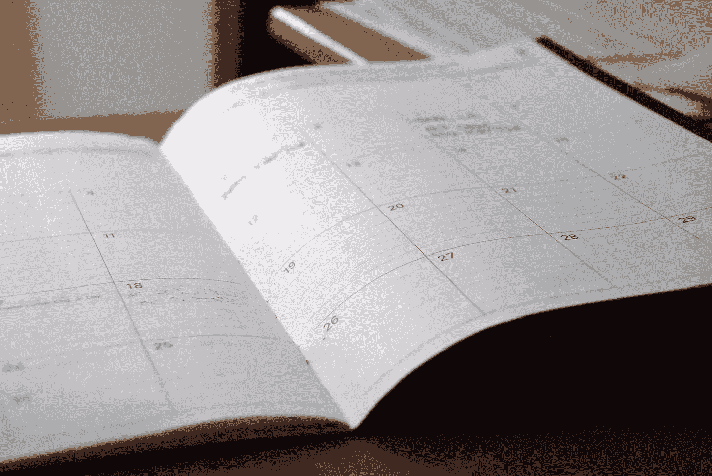

# 走向模拟:纸张规划者的好处

> 原文：<https://medium.com/swlh/go-analog-the-benefits-of-paper-planners-a2ffa0755a4e>

Originally published on [**JOTFORM.COM**](https://www.jotform.com/blog/paper-planners/)

又是一天，又是一场晨间报纸的会议。

我打开 AI Writer，开始一个新文档，开始我的每日大脑转储——至少三页不受干扰的意识流风格的写作，在那里我卸下我所有的想法、问题、想法或担忧。

晨报是我日常工作的重要组成部分。我一到我们的工作台就做这些…