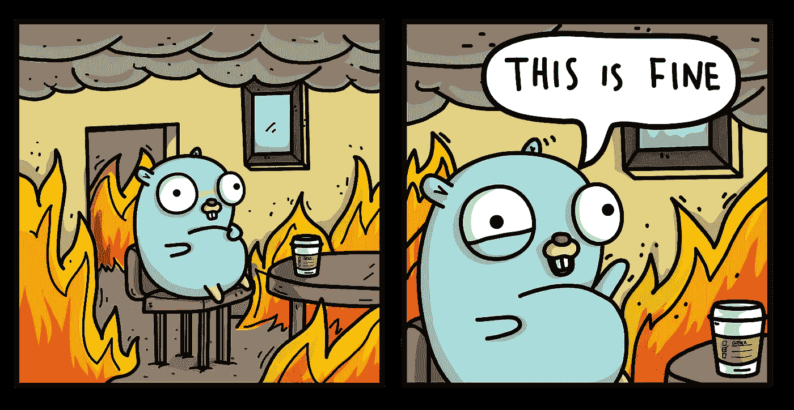

# 去神秘化的指针

> 原文：<https://medium.com/swlh/go-pointers-demystified-1f0710ec07eb>

# 指针和内存地址

虽然第一次学习 Go 时，处理指针和内存地址可能会令人沮丧，但不要让这阻止你学习 Golang。这种语言学习起来很有趣，不要让指针阻止你的旅程。

你需要知道两个符号:

*   **&** 一个变量返回该变量的内存地址