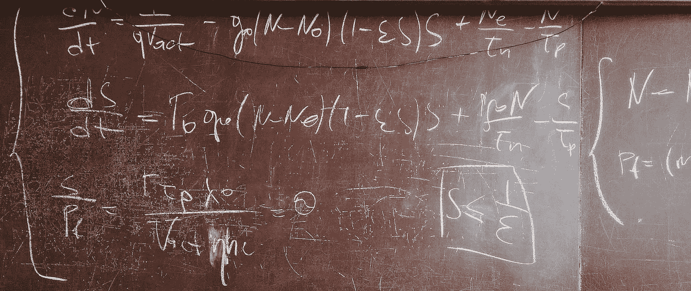

# 走老路:为生产中的快速加权采样设计算法

> 原文：<https://medium.com/swlh/going-old-school-designing-algorithms-for-fast-weighted-sampling-in-production-c48fc1f40051>

## 当面试式的挑战在现实生活中来袭时，我们用数学拯救了这一天！

***本帖原载于*** [***Taboola 的工程博客***](https://engineering.taboola.com) ***。***

如果你碰巧以写代码为生，很有可能你会发现自己在解释…