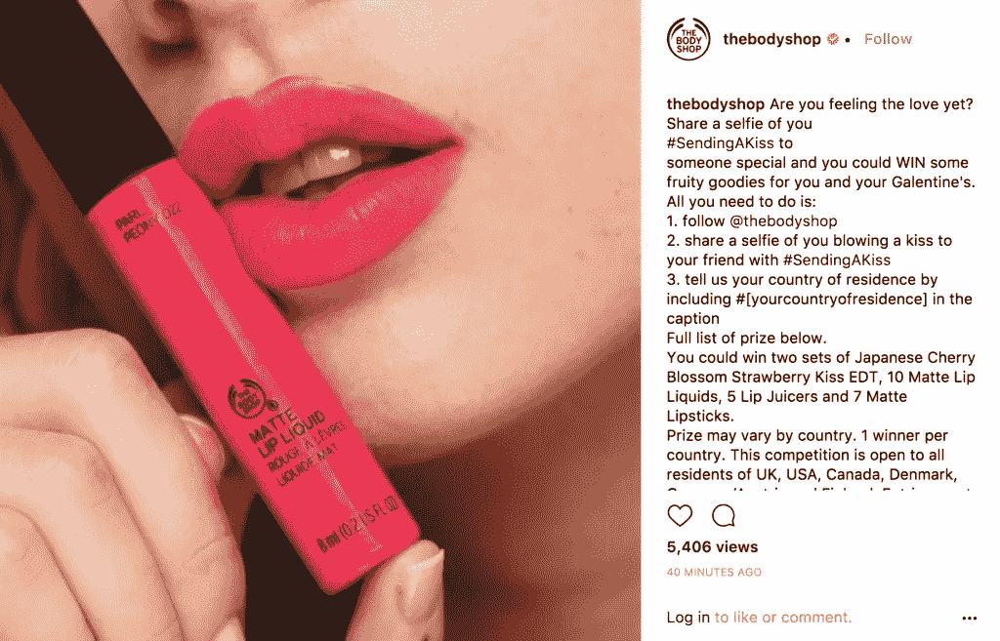

# 营销机会的金矿——如何充分利用情人节

> 原文：<https://medium.com/swlh/goldmine-of-marketing-opportunities-how-to-make-the-best-of-valentines-day-2fcdf1c6ef36>

Photo by [Adam Jang](https://unsplash.com/photos/8pOTAtyd_Mc?utm_source=unsplash&utm_medium=referral&utm_content=creditCopyText) on [Unsplash](https://unsplash.com/search/photos/marketing?utm_source=unsplash&utm_medium=referral&utm_content=creditCopyText)

扭曲爱的日子，让它与你的品牌有关——这比听起来容易得多。公司一直都在这么做，而且方式越来越有创意。事实上，人们坚信[的生意是庆祝情人节的全部意义，这一点现在已经延伸到了一个完整的星期。](https://www.nexxt.com/articles/did-greeting-card-companies-invent-valentine-s-day--7410-article.html)

因此，无论你的品牌是大是小，你想利用它来获得优势是完全自然的。几乎每个品牌都在网上做自己的事情，你如何让你的品牌脱颖而出？你可能已经对活动和社交媒体帖子有了一些想法。但是在开始之前设定好你的优先事项会帮助你获得更多的视角。

## 认识并利用你的优势

这可能是最好的，你利用情人节周的许多方面为你的优势，因为坚持一个想法不是一个非常聪明或创造性的选择。对你有好处的是，情人节一直是一个两极分化的概念。情侣们喜欢它(尽管有些人可能会觉得它很有压力！)，单身的人鄙视它，单恋的幸存者发现自己在不断的痛苦中。很多人根本不在乎。

你可以很容易地发布帖子和电子邮件来迎合每一种情绪。毕竟，它们是从情人节的概念中唤起的情感。那些被忽视的人，如单身人士或单恋者，会欣赏你对他们的呼喊，而不是幸福的夫妇。

## 保持包容性

虽然向地球上的每个人和他们在 V 日的非计划发表演讲很重要，但保持你的帖子的包容性也同样重要。嘲笑情侣或当今的传统来证明单身有多酷是不酷的。不用说，这会让你那些正在谈恋爱和庆祝节日的顾客望而却步。让每个人都参与进来——这是你获得正确追随者的方法。

## 使用“配对”方面

source: [https://www.yotpo.com/blog/best-valentines-day-marketing-campaigns/](https://www.yotpo.com/blog/best-valentines-day-marketing-campaigns/)

情人节就是要把东西配对。这个特别的主题给了你一系列的机会和想法去探索。你可以将一周中不同的日子配对，将你的顾客配对，将你自己与另一个品牌配对，举办竞赛，将不同的产品配对——可能性是无穷无尽的。你只需要把它们和你的品牌联系起来。因为…

## 保持相关性是关键

很多时候，你冒着风险，让活动更多的是关于日子或顾客(不是说它不重要)，而不是你的产品或品牌。谈论爱情的重要性，以及不仅仅是浪漫的爱情赋予我们生活的意义是很重要的。但是你需要把它和你的品牌联系起来。

以福特的快速约会情人节活动为例。产品和情人节的概念一样重要。这是迷人和有趣的，而不是说教。但最重要的是，它让福特汽车成为焦点。这是一个伟大的营销理念！

广告、帖子和交易是吸引受众的一种方式。在适当的场合，你也可以和你的听众打成一片。请他们分享他们的爱情故事，送他们情人节卡片、问候和个性化的信息，以表达你对他们的爱。你甚至不需要让他们销售，有时简单的欣赏就可以了。这样的活动从来不会失败。

## 这篇文章发表在[《创业](https://medium.com/swlh)》上，这是 Medium 最大的创业刊物，有+421，678 人关注。

## 订阅接收[我们的头条新闻](https://growthsupply.com/the-startup-newsletter/)。

