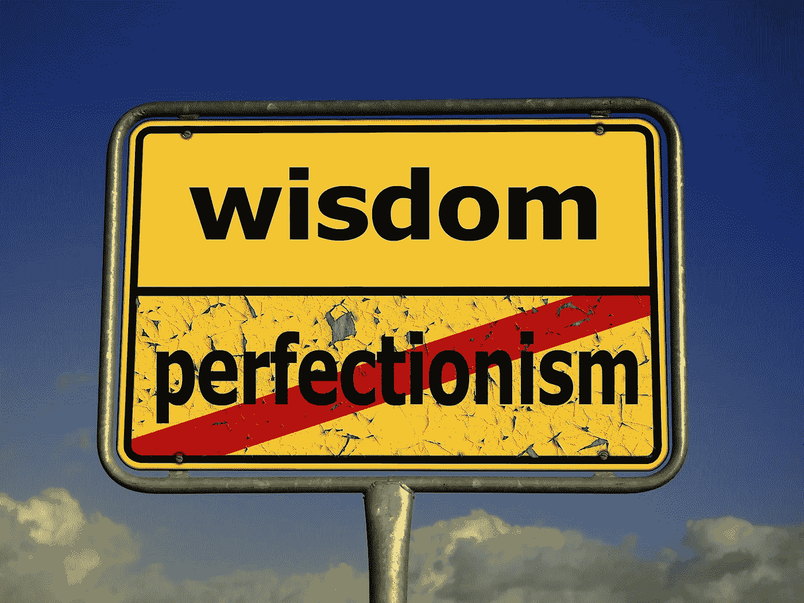

# “足够好”就够了

> 原文：<https://medium.com/swlh/good-enough-is-enough-2cacfda48928>

## 为什么克服你内心的完美主义对生意有好处

从事自由职业十年后，我终于达到了一个让我对自己的成就感到满意的境界，尽管我仍然能看到自己的缺点。接受“好”不仅是一种解放；事实上，这对可持续职业的成长和繁荣至关重要。

## 企业家精神和完美主义是相辅相成的。？

当你经营自己的生意时，自然希望每件事都达到很高的标准。毕竟，你要对最终产品或服务负责，如果你不能给你的客户留下深刻印象，他们就不会回来或向其他人推荐你。

你有充分的理由付出额外的努力来建立声誉，如果你以此为荣，你会更喜欢这份工作。但是当没有其他人告诉你*如何*好是“足够好”时，你很容易发现自己竭尽全力去达到一个不切实际的自我强加的“完美”标准——并在这个过程中筋疲力尽。

## **你是你自己*最差*评论家**

作为一名作家，我可以花几个小时为博客的开头或结尾而苦恼；有时比编写和编辑主要内容的时间还要长。我出身于学术哲学背景，在评价我的作品的论点力度和无懈可击的结构时，我是我自己最严厉的批评家。

但我从经验中了解到，如果我为一份面向非学术读者的出版物做宣传，这些对我的客户来说并不重要。按照我内心批评家的要求来改进结构所花费的时间会使大多数写作工作在经济上不可行，因为我工作的市场并不要求这是服务的一部分。

## **不要答应地球**

任何在过度拥挤的市场中竞争工作的企业家都希望比竞争对手看起来更好。但是，如果交付地球意味着你整个周末都要为微薄的时薪工作，并在这个过程中让自己痛苦不堪，那么向地球承诺就没有意义了。

即使是我们这些有幸享受工作的人，也仍然希望工作生活平衡和良好的心理健康成为默认条件；那些让我们真正投入并通宵工作的“史诗”项目应该是例外，而不是常规。

## **有些意见*不*要紧**

当然，我们都希望能够说，无论我们做什么，我们都做得很好。但这并不意味着全面的完美——如果真的有这种东西的话。更重要的是了解我们在为谁做这件事，以及对目标受众来说什么是重要的。

《玩大的[*的作者塔拉·莫尔提醒我们，我们不必将*的每一条反馈和批评都融入到我们未来的工作中，而是应该考虑它来自谁，满足那个人的需求有多重要，以及在什么时候那些需求可能会变得与我们的需求根本不相容。从十年的自由职业生涯中，我学到的一个教训是，同样的原则也适用于我们自己的内心批评，这有时会阻碍我们简单地完成工作。**](https://www.taramohr.com/the-playing-big-book/)

## **知道什么时候*够好*够了**

在我的职业生涯中，我多次感到接近精疲力竭，克服我自己的完美主义帮助我在一切都感觉太多的时候继续前进。

在许多情况下，我担心的小细节对我的客户来说没有任何影响，强迫自己在固定的时间框架内完成一项工作已经证明，最终的结果并不比我连续几天埋头苦干要糟糕得多。

这种心态的转变需要一些时间来适应；毕竟你的作品将不再*完美*。但是学习如何识别什么时候足够好是我为我的生意做过的最好的事情之一。

—

Jenni Elbourne 是伦敦的作家、慈善机构创始人和艺术顾问。她主持 [*恰当的自由职业播客*](http://www.properlyfreelance.podbean.com/) *，*，诚实的自由职业者在其中分享自由职业生活的现实。[www.jennielbourne.wordpress.com](http://www.jennielbourne.wordpress.com)