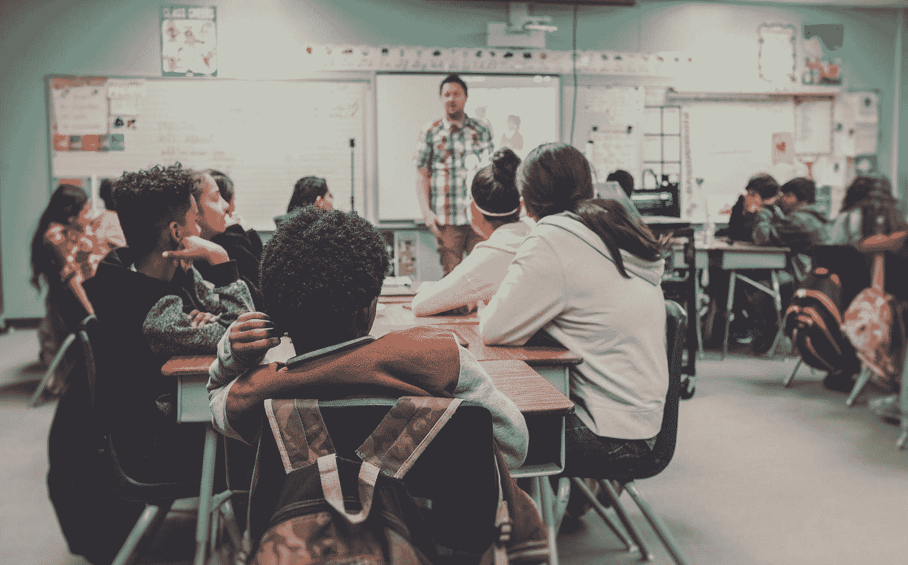

# 好的教学是关于人际关系，而不是技术知识

> 原文：<https://medium.com/swlh/good-teaching-is-about-relationships-not-technical-knowledge-29dd0d2407b6>

Photo by [NeONBRAND](https://unsplash.com/@neonbrand?utm_source=medium&utm_medium=referral) on [Unsplash](https://unsplash.com?utm_source=medium&utm_medium=referral)

现在，我正在巴尔的摩接受教师培训，寻找未来几年的教学学校。在我接受巴尔的摩市实习医生培训期间，我的导师给我看了丽塔·皮尔森[的一个 TED 演讲，题目是](https://www.ted.com/talks/rita_pierson_every_kid_needs_a_champion?language=en)“每个孩子都需要一个冠军。”皮尔逊一生都在教室里或教室周围度过，从 1972 年开始当老师，她思考着…