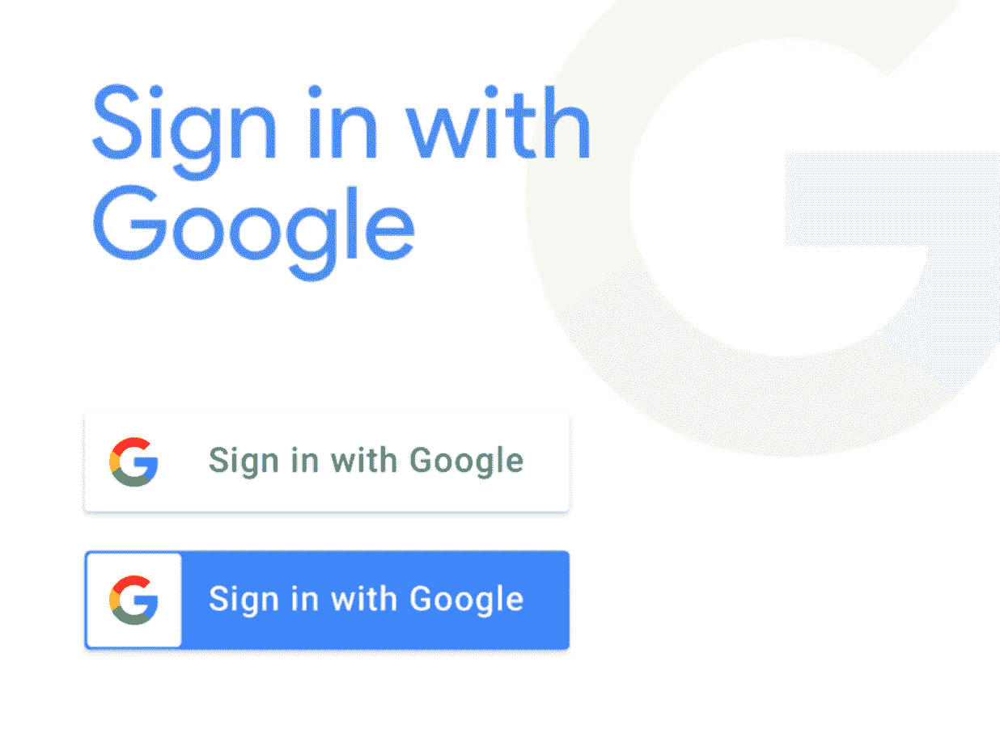

# Rails 5 应用程序的 Google 认证策略

> 原文：<https://medium.com/swlh/google-authentication-strategy-for-rails-5-application-cd37947d2b1b>

在创建我的 rails 最终项目 [WINELOG](https://wine-log.herokuapp.com/) 时，我发现很难用 Google 实现社交登录。我还发现缺少关于这个主题的最新文档或博客帖子。

这里有一个如何设置谷歌登录的快速指南。

**在谷歌开发者控制台创建应用。**选择凭证，然后选择“创建凭证”，并选择…