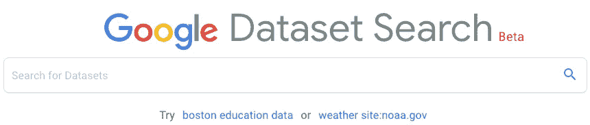
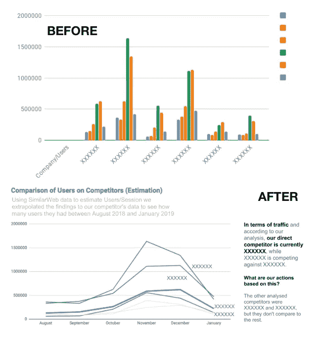

# 谷歌数据搜索，商业需要更贴近学术界

> 原文：<https://medium.com/swlh/google-data-search-business-needs-closer-to-academia-a408cf82647d>

Google is a lot more than that

当你想到谷歌时，你会想到什么？

Gmail？搜索？地图？如果你对投资于[字母表](https://abc.xyz/)的[公司的收入报告](https://hackernoon.com/how-does-google-earn-money-as-simple-as-that-60c5b399100e)更感兴趣的话，可能会有广告。

嗯，谷歌远不止这些。

谷歌背后是 Youtube、Android OS 和一系列其他软件，从云版本的生产力工具，如 Docs、Drive、Calendar，到主导数字世界的整个营销平台，[根据 iDataLabs，谷歌分析本身占据 60%的市场份额](https://idatalabs.com/tech/products/google-analytics)，我倾向于相信，在网站建设者与他们的营销套件、Wix 或 Instapage(仅举几例)快速连接后，市场份额会大幅增加。

这家公司拥有的资源数量令人着迷。此外，创新系数产品后，产品感觉无限。

# 谷歌擅长找东西

[爬行和索引](https://www.shoutmeloud.com/google-crawling-and-indexing.html)花哨的词语，并存储优化的可检索信息，这就是[我们热爱谷歌搜索](https://computer.howstuffworks.com/internet/basics/google1.htm)的原因。花些时间，尝试以不同的形式将这两个专业领域结合在一起，你最终会发明谷歌搜索，也许谷歌驱动，这样的例子不胜枚举，同样相似的技能组合，只是在这里或那里做了一些调整。

他们最近的产品发布没有什么不同，但是引起了科学界的注意。Google 宣布了一个新的搜索引擎能够为你的团队找到数据集。这有多大希望？

以 [Kaggle](https://www.kaggle.com/) 为例，[该平台以多种不同的形式对数据科学社区至关重要](https://www.quora.com/How-did-earlier-data-scientists-grew-in-the-absence-of-Kaggle-and-other-resources)，在通过精心制作的竞赛[解决现实世界问题](https://www.inc.com/magazine201403/darren-dahl/big-data-crowdsourcing-kaggle.html)保持技术发展水平的同时，为新来者提供支持。

Search for Datasets ❤

# 谷歌要解决什么问题？

该公司以民主化、开放和可共享的知识而闻名，进入科学界似乎是很自然的下一步。[数据搜索的测试版已经上线](https://toolbox.google.com/datasetsearch)，涵盖了来自环境和社会科学的数据集、政府数据以及来自新闻机构如 [ProPublica](https://www.propublica.org/) 的数据集。然而，随着预期的平台增长，数据专业人员可以指望一个学术平台，将来自谷歌学术的研究与实际数据进行分组，以进一步探索业务方面的事情。

需要解决的问题是当前的分散问题，这些分散问题是由那些依赖高质量数据来继续运营的受挫的工作部门发现的。正如开放数据研究所(ODI)首席执行官林洋·坦尼森在 The Verge 发布的[报道中所说，寻找高质量的数据需要时间和努力。](https://www.theverge.com/2018/9/5/17822562/google-dataset-search-service-scholar-scientific-journal-open-data-access)

从个人角度来看，如果我找到一个完整的数据集来处理，而不是使用重采样和引导技术，我的工程论文在实际结果方面会好得多。

总之，谷歌数据搜索是令人兴奋的消息，我会密切关注并传播这个消息。我目前的期望是，谷歌数据工作室有一个辉煌的测试阶段数据搜索将会成功。

你对这个平台有什么期待？对以后更好的解决你的用例有帮助吗？我们都希望答案是肯定的，为了更好的数据社区。

如果你对数字营销数据科学感兴趣，我会在 LinkedIn 上不断发布发现和有趣的客户用例。

如果你对数据可视化和讲故事的最佳实践感兴趣，[不要跳过我的系列文章用前谷歌专家 Cole Knaflic 的数据回顾讲故事。下面的对比是一个用数据讲故事的前后！](/swlh/storytelling-with-data-part-1-a3bdd5138958)

Storytelling with data techniques and best practices

## 这篇文章发表在 [The Startup](https://medium.com/swlh) 上，这是 Medium 最大的创业刊物，拥有+428，678 名读者。

## 在此订阅接收[我们的头条新闻](https://growthsupply.com/the-startup-newsletter/)。

