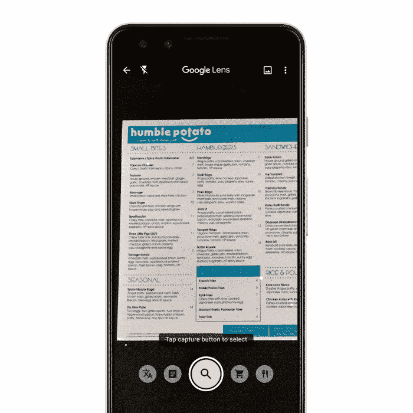

# 谷歌 I/O 2019:从第一天开始的 5 个谷歌镜头公告

> 原文：<https://medium.com/swlh/google-i-o-2019-5-google-lens-announcements-from-day-one-aa55c78c8528>

## 从翻译到食物推荐，视觉搜索无处不在。

谷歌的年度开发者大会 I/O 通常会举办一系列新的硬件和软件发布会。今年的活动于 5 月 8 日开始，虽然主题演讲的重点是硬件而不是软件，但仍有…