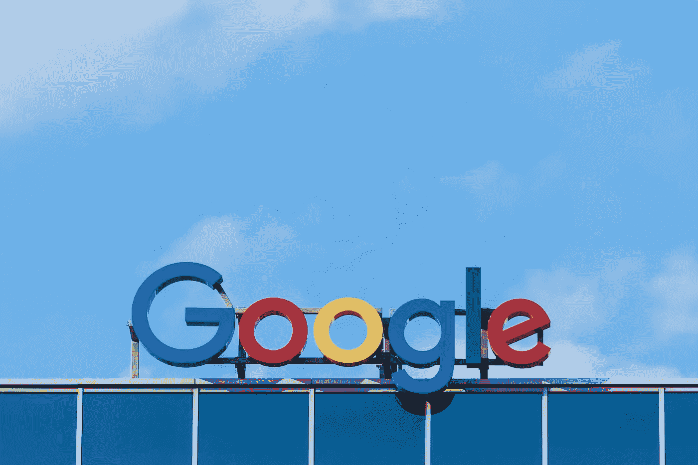

# 这就是谷歌干涉民主的方式

> 原文：<https://medium.com/swlh/google-versus-we-the-people-96c96b1cdbf5>

Image Credit: Paweł Czerwiński rom Unsplash

谁控制了过去，谁就控制了未来。谁控制了现在，谁就控制了过去，”乔治·奥威尔在他臭名昭著的著作《1984》中写道。鉴于 Project Veritas [视频](https://www.projectveritas.com/2019/06/24/insider-blows-whistle-exec-reveals-google-plan-to-prevent-trump-situation-in-2020-on-hidden-cam/?fbclid=IwAR3IfQYc2igWwtIlpzqCxwzLe5PvZQdX9gobGY5PoSsre1Cp3JkIbEuRxXM)揭露了谷歌算法的明显偏见，面对现实比以往任何时候都更重要。谷歌，Alphabet Inc .的子公司，对信息传播有着巨大的影响，鉴于该公司的偏见，它…