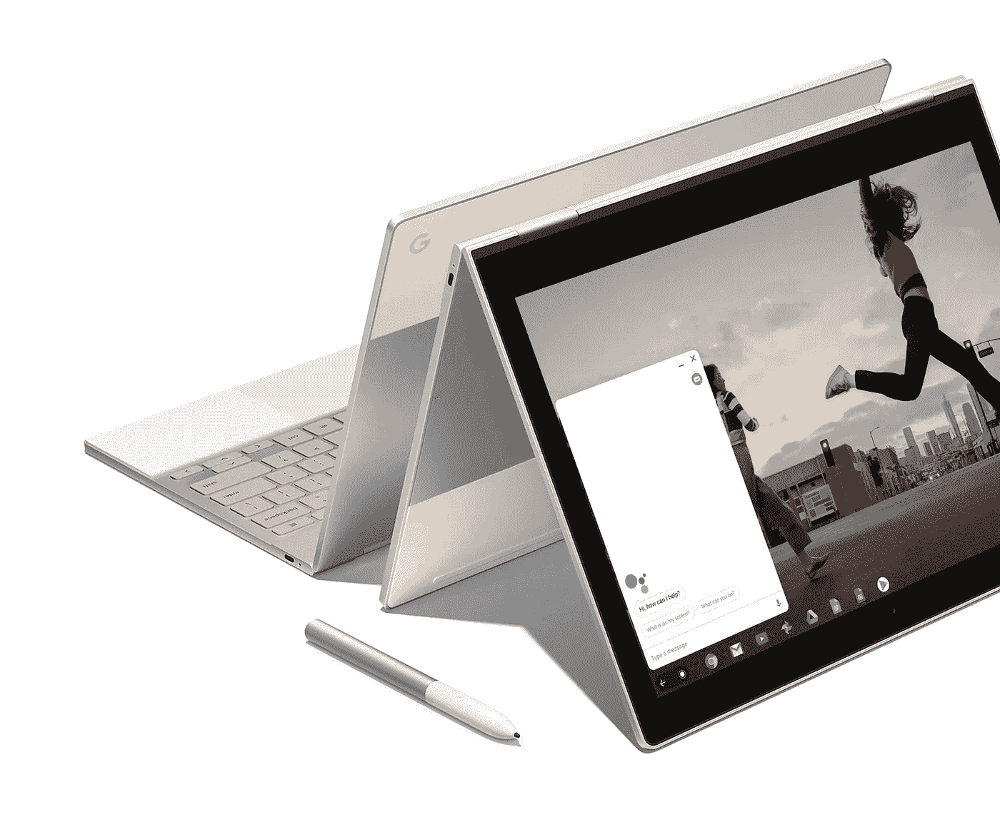

# 谷歌希望 Chromebook 成为计算的未来

> 原文：<https://medium.com/swlh/google-wants-the-chromebook-to-be-the-future-of-computing-9b76023e15fd>

## 不仅仅是你大学生的上网本？

## 因为人们想要解决方案和服务，而不关心操作系统。

The *“King of Chromebooks” according to “The Guardian”: the Google Pixelbook (*Photo: Google LCC).

以下是我的自白:当史蒂夫·乔布斯在 2001 年展示第一款 iPod 时，我根本不明白。