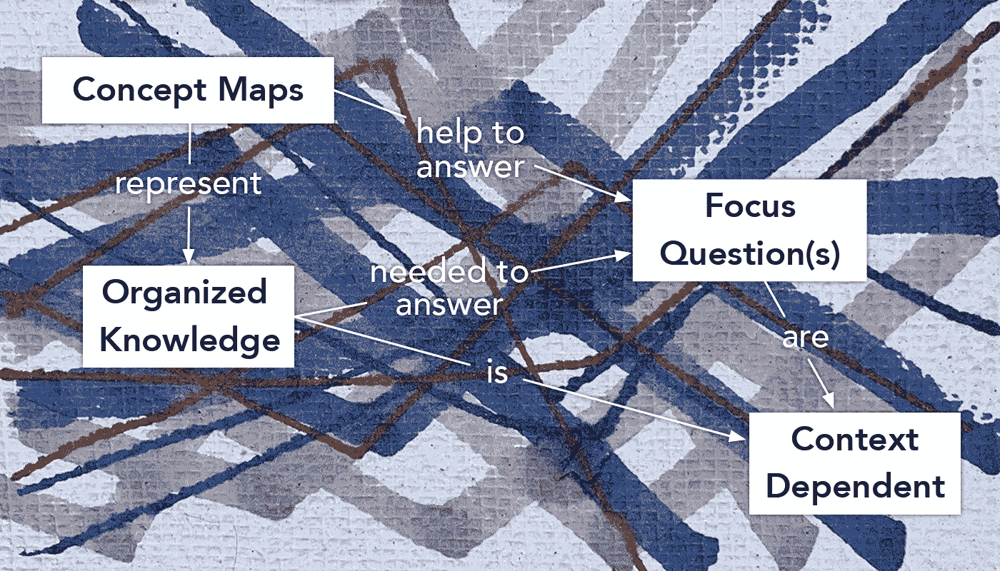

# 图形概念图

> 原文：<https://medium.com/swlh/graphical-concept-mapping-edfca6df4657>

Background by Phil Mochel

## 创新设计实践

## 将概念图组织成知识的下一个层次。

当你学习一个新的、复杂的领域时，你会使用什么方法或工具？用户体验和设计策略领域充满了工具和交付物，旨在引出和构建对要设计的体验的理解。在…的情况下