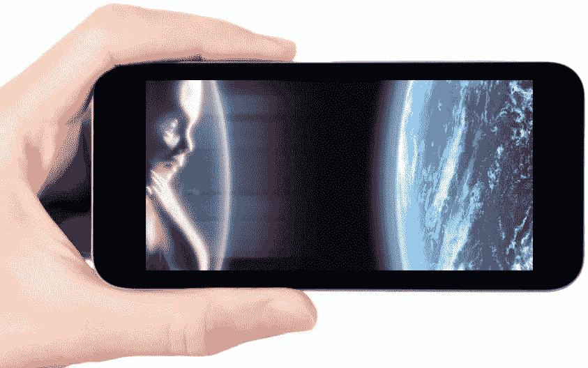

# “地球人，你们好，这是你们的绿色新车”

> 原文：<https://medium.com/swlh/greetings-earthlings-here-is-your-green-new-deal-car-30f6722ae6b3>

忘了汽车吧，它是一种笨重的东西，支配着你的生活，剥夺了你曾经拥有的自由。想想“车载电器”。精简、清洁、酷、有趣、安全、负担得起和*无人驾驶，*它将削减运营和环境成本，使有司机和无司机的打车业务有利可图。如果汽车制造商未能交付产品，最终消费者可能会是他们自己。

