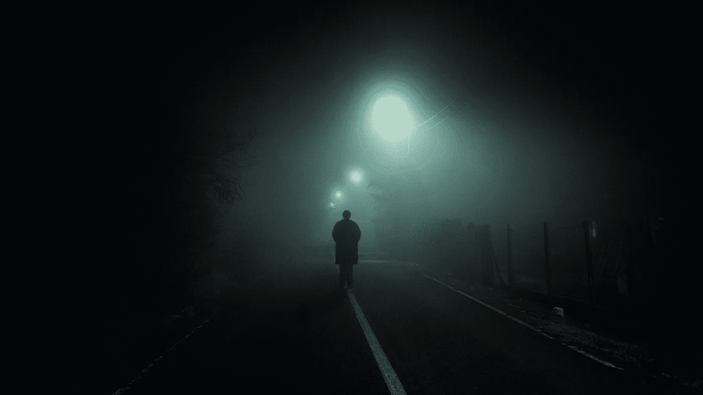

# 悲伤是一种非常人性的状态

> 原文：<https://medium.com/swlh/grief-is-a-very-human-condition-643b229db4ea>

## 每个人都会经历悲伤。不幸的是这是不可避免的。

Photo by [Gabriel](https://unsplash.com/@natural?utm_source=unsplash&utm_medium=referral&utm_content=creditCopyText) on [Unsplash](https://unsplash.com/search/photos/sadness?utm_source=unsplash&utm_medium=referral&utm_content=creditCopyText)

你不可能不经历失去就度过一生。这是人性的一部分。当你经历分手，失去朋友或爱人，或者受到伤害时，你会经历不同程度的悲伤。