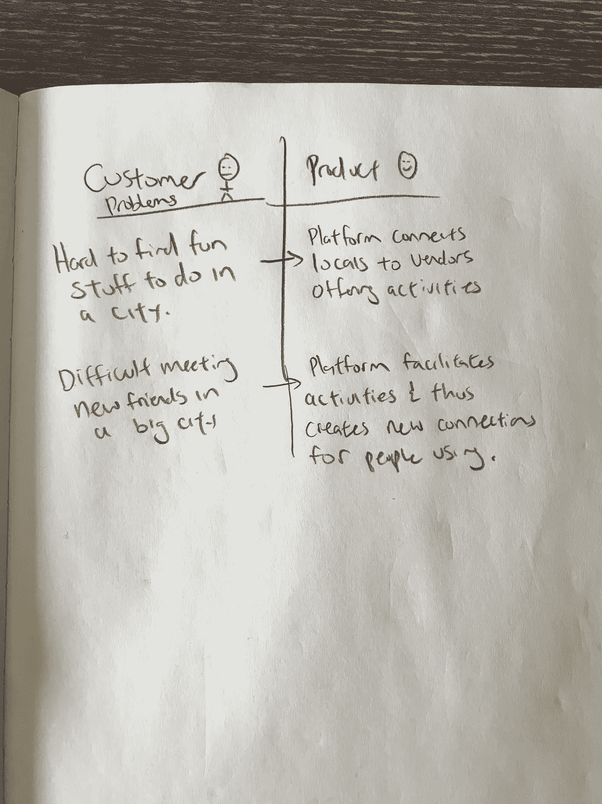

# 在 7 天内将你的想法发展成一家初创公司:用一个纸原型做一笔销售！

> 原文：<https://medium.com/swlh/grow-your-idea-to-a-startup-in-7-days-make-a-sale-with-a-paper-prototype-a06232e3eb42>

在我的职业生涯中，我已经经历了 3 次创业，要么是早期员工，要么是创始人。其中两家创业公司以*失败*告终，而第三家被收购。

不用说，和你一样，我花了很多个晚上阅读创业书籍和博客，希望了解建立成功创业公司的秘密——结果在每本书中都找到了相同的信息:建立一个 MVP，找到产品与市场的契合度。

这些陈述之后通常会有一个例子，某人有了一个想法，建立了一个 MVP(最小可行产品)，在一周内达到 100 万用户，然后在一年后被收购。

这些故事常常鼓舞人心，引人入胜，但总是留给我更多的问题而不是答案。

1.  创始人是如何知道哪些特性是 MVP 的一部分呢？

2.创始人是如何这么快就打造出他们的 MVP 的？

3.他们是如何吸引第一个顾客的？

**我们都知道“构建-测量-学习”的反馈循环，但是我们到底该如何执行呢？**

事不宜迟，我将与你分享我的框架，让你在一周内将想法转化为产品。无需编码！

# 第一天:构思阶段

读一下这句话。

> “想法是无用的，执行才是一切”

再读一遍。

以此为生。

你可以和你的朋友和同事讨论为什么你的想法是最好的，或者抱怨另一家公司如何“窃取”了你的想法。

或者，你可以在 7 天内将这个想法变成一个真正的公司…

第一步是确定你思考最多的一个想法。不要担心它考虑得不够周全，如果你有预感它会起作用并解决某人的问题，那么是时候做出承诺了。

**现在是时候暂停你所有其他的想法，投入接下来的 7 天。**

现在，通过获得责任为成功做好准备。这可能有两种形式，*告诉你的朋友&家人你正在建立一个新的创业公司*，或者，我更喜欢的方法，在[indiehackers.com](http://indiehackers.com)上发布一个关于你的创业公司的帖子。Indiehackers 是一个创业者社区，分享他们的想法或写博客记录他们的创业历程。

> “告诉你的朋友和家人你正在建立一个新的创业公司，或者，我更喜欢的方法，在[indiehackers.com](http://indiehackers.com)上发布一个关于你的创业公司的帖子。”

这一步的重点是通过让别人知道你在做什么来真正投入自己。此外，它打开了与别人而不是自己交谈的大门。没有一款好的产品是单独打造的。

# 第二天:与你的潜在客户交谈

此时，你应该对谁是你的客户有一个非常模糊的概念。*找到他们。*

怎么会？

**在 Reddit 上开始讨论，**开一个新话题，询问人们是否有类似的问题(你必须有创造性地找出这些答案)，或者他们是否认为这个想法可行/不可行。

**通过 LinkedIn** 与他们联系，并开始提问。我发现 LinkedIn 是开始我的客户研究的一个不可思议的资源。如果我给我的社交网络之外的人发短信询问他们的意见，我发现我得到的*回复率大约是 5%* 。

**在 Instagram 上与潜在客户互动**。这将是一个关于你有多了解你的客户的练习。根据你之前所做的研究(例如，Reddit & LinkedIn)，你应该能够找到包含你潜在客户的**标签**。

与之前类似，通过 DM 与他们接触并提出问题。此外，如果你觉得自己找到了典型的客户资料，保存他们的 instagram 账号，这样你以后就可以围绕他们的资料设计你的销售信息(例如，运用设计思维原则)。

# 第三天:用纸和铅笔设计你的产品

当你的想法获得一个客户或做成一笔生意时，它就实现了。然而，这是最难的部分。

大多数企业家在这一点上开始考虑一个网站，布局和价值主张的信息。*如果创业者碰巧是一名开发商，他们会在接下来的一周/一个月内进行建设，如果不是，创业者会开始寻找其他可以免费/低成本建设的人。*

> **这两个选项都耗时太长。**

我们要做一个纸原型，然后卖掉它！

现在是时候拿出你的纸和笔，开始思考你的客户的问题和你的产品的解决方案。您已经通过在线论坛对您的客户做了一些初步的研究，现在是时候展开营销了！

在下面的例子中，我快速地勾勒出了我最近工作的一家初创公司的两个要点。创业背后的想法是将当地人与每个城市的独特活动联系起来(例如，想想 AirBnB 的活动——在他们自己实际实施这个想法之前的几年)。

您的产品已完成！

就这么简单。

# **第 4–7 天:销售、学习、迭代&销售**

既然你已经对你的产品将如何解决问题有了一个*清晰的想法，那么是时候找到一种方法来促进销售或关于产品的对话了。对于我上面使用的特殊例子，我试图建立一个双边市场。*

这需要一个提供活动的供应商网络和另一个对这些活动感兴趣的用户网络(这些用户也有我正在解决的问题)。

虽然在进入销售周期之前有一个网站来建立信誉是很好的，但你在这里的工作是发展你的销售技巧和网络。如果没有网站你就卖不出产品，那么有了网站你可能也卖不出去。

> 如果你没有网站就卖不掉一个产品，那么你很可能有了网站也卖不掉。

你不会想象你会从与你的顾客交谈中学到多少。**这些洞见将会是创造一个非常平庸的产品和为你想要服务的客户群创造完美产品之间的差别** **。**

就我而言，在建立网站之前，我先花时间和我的客户在一起，这让我为已建立的旅行社和旅游局建立了一个市场。我最初的想法是让当地人为其他当地人举办活动，但在我多次致电旅行社和旅游专家后，我发现了一个小商机。我能够用一张纸、一支笔和一段关系完成我的第一笔销售。

> 我能够用一张纸、一支笔和一段关系做成我的第一笔生意。

在这一点上，你基本上已经花了一周的时间对你的想法进行实际研究。如果你能够在遵循这些方法的一周内获得牵引力，那么是时候建立你的网站和/或产品了。

# 结论

想法毫无价值，执行才是一切。

选择一个你最近一直在思考的想法，并花 7 天时间去实现它。告诉你的朋友和家人，在[Indiehackers.com](http://www.indiehackers.com)上发帖，并致力于将这个想法变成一个真正的产品。当你开始开发你的产品时，责任是关键。

开始与潜在客户讨论你的想法，然后用最初的反馈来充实你的纸上原型。一旦你用你的纸上原型开发了你的推销，是时候销售你的产品了。

从现在开始，你需要的只是坚韧和勇气。祝你好运！

______________

感谢阅读这篇文章！

我最近获得了一笔资金，用于开发一种基于人工智能的产品。我将在博客上直播我在全球人工智能孵化器(TBD)的经历。

请关注我，了解我们旅程的最新进展，并从我们的错误中吸取教训。

## 这篇文章发表在 [The Startup](https://medium.com/swlh) 上，这是 Medium 最大的创业刊物，拥有+414，678 名读者。

## 在此订阅接收[我们的头条新闻](http://growthsupply.com/the-startup-newsletter/)。

