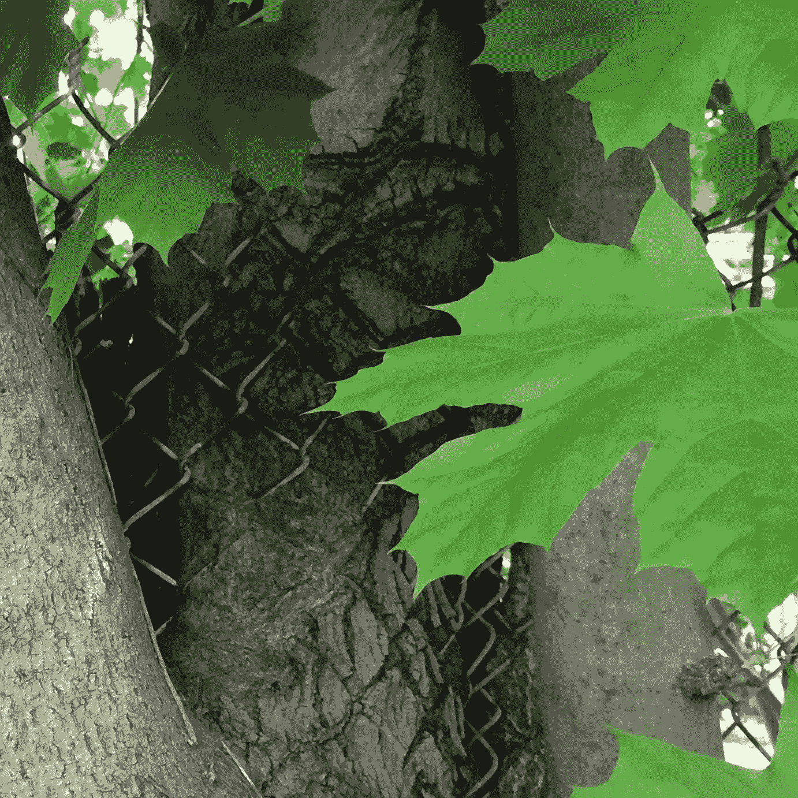

# 增长和障碍

> 原文：<https://medium.com/swlh/growth-and-barriers-e1d3fc0a4f2>

## 每个伤疤都是我幸存的证据。

## 没有栅栏能阻止这棵树表达自己。

Tree outside the Natural Market in Garden City, NY (photo by Tina Lear)

当我把车停进杂货店的停车位时，我从方向盘上抬起头，看到了一棵树。显然，随着它的成长，栅栏的安装是基于这样一种想法，即树会在一边。树没有得到备忘录。只是保持…