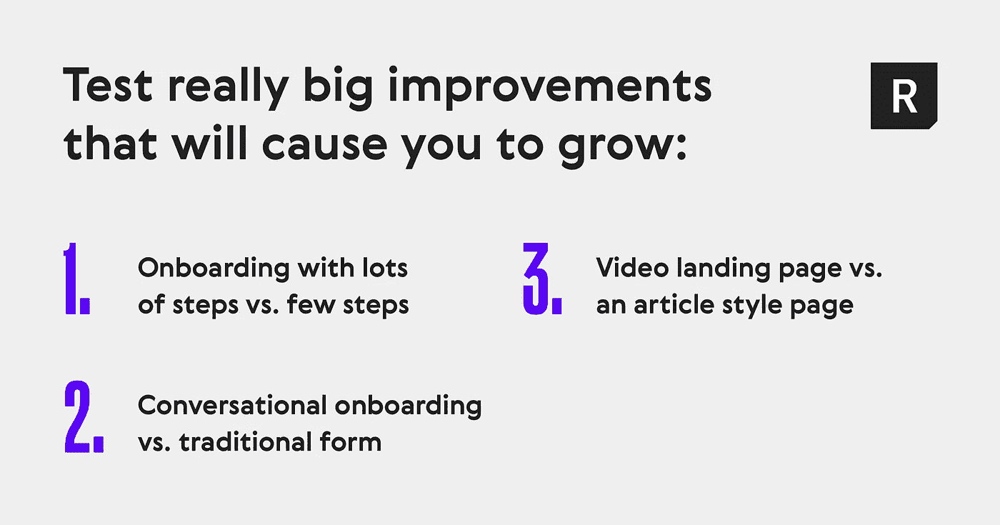

# 如何加速早期创业公司的成长

> 原文：<https://medium.com/swlh/growth-b5dc83e022ac>

最近，我有机会采访了产品管理专家布雷迪·弗林(Brady Flynn)，他是 [*Primer*](http://goprimer.com/) *的创始人，这是一个营销平台和服务，已经帮助微软和* [*hims*](https://www.forhims.com/) *等公司通过将营销活动与定制登陆页面相结合来提高转化率。布雷迪分享了他从帮助早期创业公司中学到的东西。以下是他关于加速成长的建议。*

*这是布雷迪关于扩大早期创业公司的采访摘录。要了解更多，请查看* [*全文*](https://realtimeboard.com/blog/accelerate-growth-early-stage-startups/?utm_source=thestartup&utm_medium=referral&utm_campaign=blog_realtimeboard&utm_content=primer) *。*

# 进行正确的测试

我们喜欢说，成千上万的测试总是有结果的。如果你考虑运行数以千计的测试，前 5%将会是异常值。在这些测试中，你会发现两倍和三倍于你的成功的东西。你需要确保你测试的是真正伟大的想法。

你不希望每件事都是上一件事的小重复。所以当你测试的时候，如果你处于一个非常小的阶段，你没有很多流量，确保你正在做这些非常大的改变和测试。这就是目标衡量标准真正重要的地方。然后之后，你可以看看这些测试，然后说，“我正在朝着我的最终目标前进吗？”如果没有，那么让我们暂停这个测试，然后继续。这也很重要，确保如果某件事没有在你预期的时间内变得重要，是时候继续前进，测试下一件事了。你不是在寻找真正小的改进。

你在寻找那些真正能让你跳跃和成长的巨大进步。你可以用很多步骤和很少步骤来测试入职，对话式入职和传统形式，视频登陆页面和文章风格页面。将测试与专注于客户目标和问题、专注于你的主要目标、专注于努力提高你的增长目标结合起来，你会发现自己突然达到了增长目标。回顾上个月，你会说，“我们实际上是如何实现这一重大变革的？在过去的 6 个月里，我们一直在测试或做些什么？”一切看起来都是递增的。但是，一旦你开始以客户为先，进行这些真正大的测试，你将开始看到 30%或 50%的阶跃变化，2 倍或 3 倍的增长，这是你以前没有得到的。

# 寻找产生重大影响的方法

你必须追求大创意的原因之一，尤其是在一家初创公司，是因为你还没有足够的流量或潜在客户来测试那些微小的东西。脸书将测试一些东西，他们将能够说，“嘿，这个提升了这个统计 1%！”如果你试图运行一个测试来提升 1%的东西，你会在测试结束前就破产。

所以，早期公司需要做的一件事是测试真正的大变化。然后，一旦你意识到你正在测试的东西不太可能是一个真正的大变化——假设你有 5%的改进，而你需要一个月的时间来获得显著性——你只需要继续前进。所以，试着给你的测试设定一个时间限制。“嘿，我们想每 2 周做一次测试，每 2 周我们想要一个特定的转换目标。”如果你想在一个成功的变体上有超过 100 个转换，那么你需要在两周内做出足够大的改变。

在 2 周结束时，如果你不知道它是否会很显著，那么就继续前进，直到变化更加明显。你必须知道什么时候放弃考试。设定一个时间框架。

# 轨道保持力

要跟踪的最重要的指标之一是保留率。你看到的是那些为你的服务付费的人的保留率，无论是订阅还是电子商务环境下的回访。很多时候你可以通过有多少人回来订阅来衡量。看你的回头率或者留存率。随着您的成长，这些指标会变得越来越重要。

如果你回头看，你会发现你的保留率从 95%下降到 90%，这在一年的时间里会产生级联效应。当你改变你的漏斗时，这可能是一种平衡行为。当你改变你的漏斗以实现目标转换时，你也需要在后端观察留存率。我们通常说要有你的核心指标，可能是新客户作为增长指标。但也有一些你正在关注的其他公司健康或商业健康指标。

我们通常建议有一个总体的成长目标，那就是你的北极星。但是一定要有另一个指标——你当前的客户指标。至少每月观察一次这些指标，这样你就可以每月检查它们，看看你是否做了一些改变，这些改变对它们产生了积极或消极的影响。对每个人来说，逐月改善，或者至少保持稳定是很重要的。

## 这篇文章发表在 [The Startup](https://medium.com/swlh) 上，这是 Medium 最大的创业刊物，有+427，678 人关注。

## 订阅接收[我们的头条](https://growthsupply.com/the-startup-newsletter/)。

