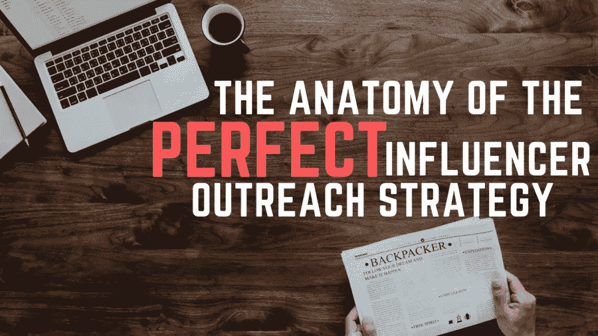
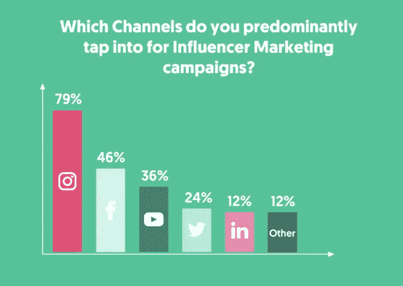
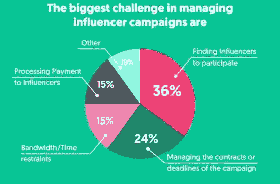

# 指南:完美影响者拓展策略的剖析

> 原文：<https://medium.com/swlh/guide-the-anatomy-of-a-perfect-influencer-outreach-strategy-825452783d4b>

想要终极品牌协作示例电子邮件吗？当然了。不幸的是，没有一封邮件能给你带来 80%的回复率。但是，我可以帮助您撰写最佳影响者提案，并尽可能提供模板。我将帮助您完善您的影响者拓展战略，以持续接触影响者，激发他们的兴趣，并为职业关系定下基调。

# 品牌协作示例电子邮件

让我们从一封品牌合作样本电子邮件开始(请随意浏览，但我鼓励您通读其余部分，以确保战略理解。)

***主题行*** *:与【品牌名称】的合作机会*

*嗨[名字]，*

*【您的姓名】来自【品牌名称】——【关于您的价值主张的一句话】。*

*我们正在寻找[你的利基]行业最有才华和影响力的内容创作者。我相信你非常适合担任我们的独家品牌大使。*

*这些是付费演出，要求你在社交网站上用自然、真诚的声音与你的粉丝分享我们的品牌。*

如果你有兴趣了解更多，请给我回复，我会发一份包含所有细节的报价。

*说话很快，*

*【你的名字】*

试试用这个，用电子邮件跟踪器发送你的前一百封电子邮件——这让我们可以建立一个基线。一旦你建立了这个基线打开率，开始调整你的电子邮件，尝试提高回复率。记住，你的外联邮件的工作是激起兴趣并得到回复，而不是达成交易。不要用信息淹没你的影响者——他们也讨厌阅读小说或电子邮件。

## 您的初始电子邮件

# 包括

*   快速记录您的价值主张。
*   简短、有力、简洁的措辞吸引人。
*   简单介绍一下你所处的位置。
*   一个直接而简单的行动号召，让你很容易答应。

# 不包括

*   要约(如果没有回应，您可以在后续电子邮件中包含此内容)。
*   一整段关于你的品牌是谁，你代表什么，为什么你从所有其他人中选择了这个特别有影响力的人。
*   问多个问题。保持整洁干净。请回答这封邮件中唯一真正重要的问题。“你希望了解更多关于成为我的品牌的影响者的信息吗？”
*   夸大你的产品或你的大使/影响者计划。不要夸大任何特征，否则你最终会失败的。

让我们来分析一下上面的邮件，以理解为什么这种方法如此有效。首先，主题行告诉他们有合作的机会。很有可能，你不会是影响者的第一个合作提议，所以他们熟悉术语，并期待收到这样的提议。

在正文中，我们与他们建立联系，这比“嘿，伙计，我把你从 15，000 个有影响力的人中选了出来，你是第 3903 个幸运儿”这样的话更有意思。以一种更有机的方式找到你的影响者，向他们展示你在你的领域的投资，更重要的是，展示其中的思想领袖。你简单描述一下你的品牌——足以让他们知道你的品牌价值观和他们的一致。我在影响者拓展策略中看到的最常见的错误之一是营销人员漫谈他们自己的品牌。太多关于你自己品牌的信息对你不利。

接下来，你就可以直奔主题了。这一行一定要简洁明了。这个一行程序对于用免费产品来交换帖子非常有用，但是也没有选择付钱。

接近尾声时，我们问了一个直接的问题——您有兴趣成为我的品牌的影响者吗？不要把这个和其他次要问题或细节混淆，这些问题或细节可以稍后解释。

最后，我们发出简单的行动呼吁。尽可能让影响者以你们都能理解的方式回应你。他们需要回答的只是“当然”或“告诉我下一步该怎么做！”

*   *专业提示:为了充分利用你的拓展努力，使用类似于 [Rebump](https://www.rebump.cc/) 的工具来提高打开率。

现在，您已经了解了品牌协作推广电子邮件模板的结构，让我们来看看提议和报价模板，这是您将与影响者交流的一系列电子邮件中的下一封。

# 【你可能会疑惑:DM 好还是 email 好？]

只要有可能，最好给有影响力的人发电子邮件。这并不意味着，如果你找不到电子邮件，就不应该进入目的地管理系统。我们大多数营销人员都是在电脑上而不是在手机上进行影响者线索生成。许多有影响力的人在他们的个人资料上列出了他们的电子邮件，只是在你的桌面上看不到而已。花额外的 30 秒钟在手机上调出账户，以获取最佳联系方式。

大多数营销人员都在追求 Instagram 的影响者，但这些策略将适用于任何你想要的平台。

Influencer Marketing predominant channels

# 影响者建议模板

恭喜你。你的收件箱里塞满了好奇的有影响力的人，他们想知道与你的品牌合作需要什么。这是你真正能够为关系定下基调并达成交易的地方。

我没有你回答的模板，因为大部分都取决于你提供的细节，所以我们将坚持这一阶段沟通的纯策略。如果你一直试图把最初的电子邮件和提议的所有细节都塞进去，你会很纠结。考虑将它们分开，因为这会给你更好的回应和成交率。

通过确认*他们*有兴趣与你合作来开始你的电子邮件。这里有一个很好的开场白:*“太好了，{{first.name}}很高兴听到您有兴趣与我们合作，您会喜欢{product}。”*

接下来，在电子邮件中，你可以告诉他们合作的细节——越详细越好。请务必尽可能简单地概述以下各项:**预期交付成果**、**时间框架**和**补偿**。

你的结束语也应该非常清晰，直截了当。类似于*“如果你觉得不错，请把你的邮件地址发给我，我会马上把一些{product}寄给你。我们很高兴您成为我们团队的一员！”*

或者，如果你要付钱给他们，这里有一个小小的变化:

*“如果你觉得不错，请把你的邮寄地址和 PayPal 地址发给我。一旦我有了，我会马上把一些{product}寄给你并付款。我们很高兴您成为我们团队的一员！”*

# 影响者外联战略

总的来说，你的影响者拓展策略是双重的。

**第一步**。激发他们的兴趣并得到回应。

**第二步**。告诉他们你的计划和报价。保持信息简单，像人一样说话。现在不是过分正式的时候！请记住，大多数有影响力的人都是十八九岁到二十八九岁的年轻人——与坐在董事会会议桌另一端的人相比，他们更容易对像密友一样的谈话做出反应。

如果你不喜欢使用 CRM 来跟踪你的影响者线索，那么一定要使用 Excel 表或谷歌表，以确保你不会一次又一次地轰炸相同的影响者。如果您想将它导入任何其他工具或平台，它还将帮助您构建自己的数据库。

一旦你让你的影响者参与进来，并欢迎他们加入你的项目，马上离开模板。努力去了解你的影响者，因为他们经常充满了你的顾客的反馈。要善于交谈，把它们当作你品牌的延伸。就像客户一样，如果你能超额完成商定的合作细节，他们也会回报你，超额完成他们对你的承诺。

如果您想了解更多关于主动影响者管理的信息，以及如何在通过这一影响者拓展战略充实影响者渠道后最好地利用您的时间，请查看类似于[影响者营销专业人员开发工具包](https://introfuel.com/development-kit/?utm_source=brganic_traffic&utm_medium=blog&utm_campaign=outreach_template)的产品。如果你对这个行业比较陌生，并且你在管理和报告你的影响者营销工作上有困难，我强烈建议你使用上面的工具包。

BIggest challenges managing influencer marketing campaigns

使用上面的模板和策略，跟踪每一件事，并在需要时实施改变。有影响力的人比以前更怀疑不可靠的品牌和不兑现的承诺——所以你的初始模板应该是干净和专业的。