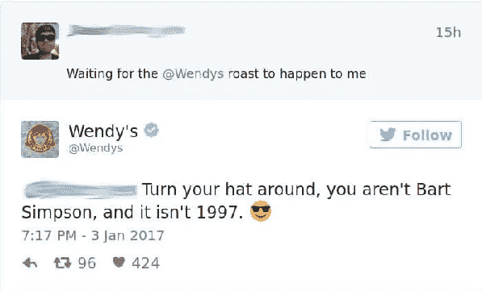
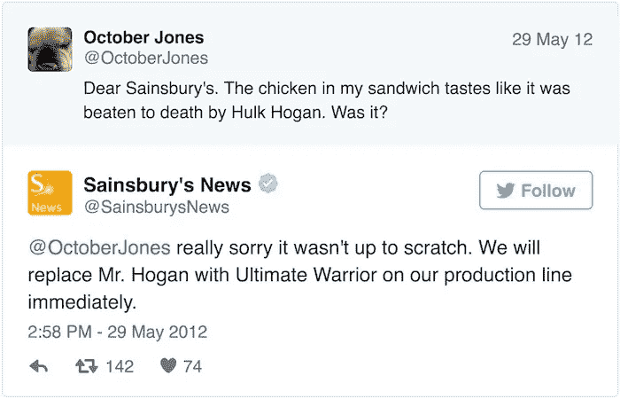

# 如何将反对票转化为胜利:管理社交媒体评论的简短指南

> 原文：<https://medium.com/swlh/guide-to-managing-social-media-critique-3f63203c1325>

Photo by [William Iven](https://unsplash.com/photos/DfMMzzi3rmg?utm_source=unsplash&utm_medium=referral&utm_content=creditCopyText) on [Unsplash](https://unsplash.com/search/photos/social-media?utm_source=unsplash&utm_medium=referral&utm_content=creditCopyText)

所以 Slack 的新标识并没有像它希望的那样受到人们的欢迎。这个新标志收到了很大程度上的负面影响，网络无法停止将它等同于鸭子、以前的药店标志，甚至纳粹万字标志等等。然而，Slack 采取了坚定的立场来支持标识更新。

位于中间的是@ Slack HQ——Slack 的官方 Twitter 账号，它在过去两天的大部分时间里都在机智地回应，并坚定地保证新标志恰当地反映了神奇的团队聊天应用的未来。

从承认一直想探索洒水器的世界，到优雅地拒绝拉特朗普的请求并切换回旧标志，回复来得很快，更重要的是，带有一丝谨慎，以免另一场争议抬头。

这也是我们战胜网络巨魔和负面评论的地方。品牌不能恶意回应，而是要深思熟虑，总体情绪积极。越来越多的品牌已经开始以这种方式回应他们社交媒体档案上的巨魔和一般反馈。

## 那些已经在杀害它的人

Wendy's 在 Twitter 上以其时髦和机智的反击而闻名，以至于人们主动要求被“烤”。像人一样说话，而不是像一群运营公司的人一样说话，温迪的回复常常会被认为是粗鲁的。但这已经成为该品牌的某种 USP。

特易购手机向那些认为他们的妈妈和女朋友不酷的人发出警告，因为他们使用特易购——当然，还有野蛮的反击。

过线烤自己的客户，听起来就很恐怖。毕竟他们是你的付费客户(或者至少是潜在客户)。大多数时候，优雅的回应最有效。许多品牌只会试图将损害最小化，即使是在使用幽默并完成它的时候。

## 何必回复呢？

无论是亲切的回应还是讽刺性的回击——事实是，品牌不应该对负面批评置之不理。这既是一种需求，也是一种很酷的趋势。社交媒体已经出现，并将自己定位为品牌与受众联系的黄金机会。品牌现在可以选择与客户交谈和交流，并以个性化的方式吸引潜在客户。

但是个人交流是双向的。现在，消费者也有同样多的选择与品牌“对话”,让他们知道他们对品牌的看法——包括好的方面和坏的方面。

> 如果你的品牌“喜欢”关于它的好东西，它也必须同样积极地回应不太好的评论。

[他们如何做](https://www.forbes.com/sites/jaysondemers/2016/12/21/5-brilliant-ways-to-respond-to-criticism-on-social-media/#27eb8b9b3dd2)完全取决于他们想要为自己创造的品牌形象。Denny's 更喜欢[“爸爸的笑话”的方式](https://www.socialsamosa.com/wp-content/uploads/2018/02/Dennys.jpg)，而 Wendy's 是为了得到反对者。

回应批评只是纠正过程的一部分。虽然，没错，许多负面评论只是谣言，但也有许多人是对你的产品或服务感到失望的真正顾客。以一种令人放心的方式回复并承诺解决问题应该是你首先关心的——而不是给出一个机智的回答。在失败中保持优雅肯定会大有帮助。我们都可以[从懈怠中学习](/swlh/the-tyranny-of-an-updated-logo-ff317e1807cc)！

## 这篇文章发表在 [The Startup](https://medium.com/swlh) 上，这是 Medium 最大的创业刊物，拥有+413，678 名读者。

## 订阅接收[我们的头条新闻](http://growthsupply.com/the-startup-newsletter/)。

