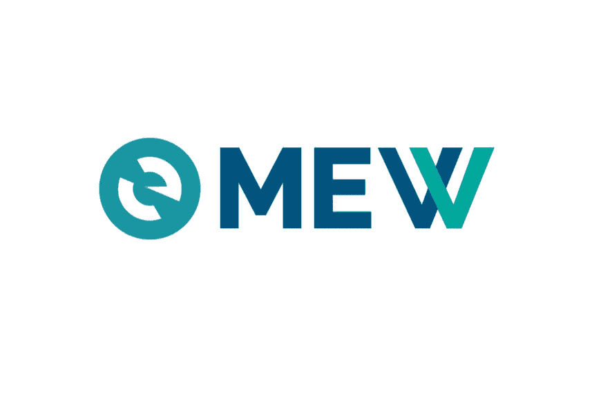
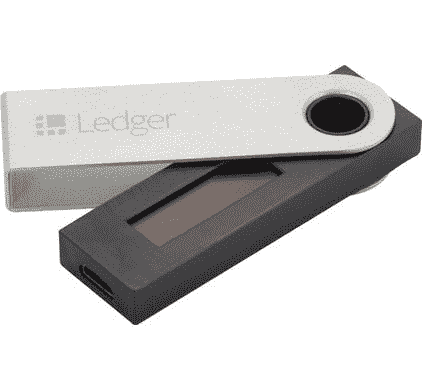
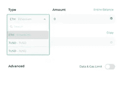
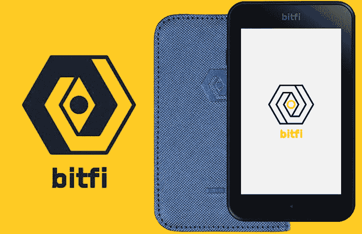
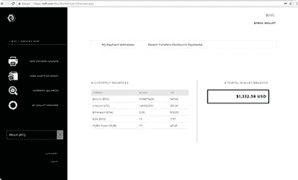

# 在流行钱包上存放 ERC 20 代币指南

> 原文：<https://medium.com/swlh/guide-to-storing-erc-20-tokens-on-popular-wallets-be193e9279dc>

> 最新的[加密货币新闻](https://www.coincurb.com/news/)、[空投清单](https://www.coincurb.com/airdrop/?status=active)、[赏金清单](https://www.coincurb.com/bountyc/?cat_id=188)、 [IEO 清单](https://www.coincurb.com/category/active-ico/)，请访问 CoinCurb.com。

区块链以太坊的成功导致了数以千计的 ERC 20 代币的诞生，这些代币属于有意义的项目，也属于不太有意义的项目。如同以太坊的情况一样，ERC-20 令牌的安全性是每个加密持有者主要关心的问题。以太坊空间中有许多普遍使用的钱包，但其中三个是 MEW(在本文中用于创建纸质钱包，但可以用作网络钱包)、Ledger(冷存储硬件钱包)和 Bitfi(无存储的硬件钱包，一个私钥生成器)。

这篇文章深入探讨了在流行的以太坊钱包中查看和存储 ERC-20 代币的过程；它还研究了检查所有持有令牌的实时值的方法。

值得注意的是，ERC-20 代币可以发送到任何以太坊钱包，除了加密货币交易所。如果交换目前不支持令牌，将该令牌发送到交换将很可能导致该令牌的永久丢失。另一方面，如果你控制了以太坊钱包的密钥，你可以发送任何 ERC-20 令牌给它，而不需要任何预先的步骤。不过，在某些钱包上查看代币数量可能有点麻烦；而查看报价可能是一个额外的过程。

# **MEW 上的纸质钱包**

MyEtherWallet，俗称 MEW，允许持有者创建一个以太坊纸质钱包，这是一种原始形式的冷存储(离线存储私钥)。以太坊纸钱包非常适合长期持有 ERC-20 代币，只要持有者能够正确创建纸钱包并保护私钥。不建议对技术知识了解不多的用户使用。

要通过 MEW 设置钱包，请前往[https://github.com/kvhnuke/etherwallet/releases/latest](https://github.com/kvhnuke/etherwallet/releases/latest)获取钱包的. zip 文件夹。下载完钱包后，你**必须**下线(断开电脑与互联网的连接，防止钱包信息被黑客截获的风险)。现在，解压文件夹并点击 index.html 文件。您的纸质钱包创建过程现在开始。请务必选择一个好的但容易记住的密码来加密您的私钥。接下来，一旦你有了私钥，仔细记下它，并四次检查你是否正确地复制了每个字符。如果您复制了错误的密钥，您将无法访问您转移到纸质钱包中的资金。

现在，您应该清除 web 浏览器上的所有 cookies 和缓存，并在将计算机重新连接到互联网之前重新启动计算机。如果您打印了纸质钱包，您还应该清除打印机上的内存，因为纸质钱包的副本仍留在打印机内存中，有人可能会打印出另一份副本。小心遵循所有的安全程序，以确保你的钱包在使用前不会受到损害。

**交易**

一旦纸钱包被创造，你已经为你的 ERC-20 代币和 ETH 发展了冷藏。你可以从任何交易所向纸质钱包上的地址发送资金(包括 ETH 和所有 ERC 20 代币),并且你必须使用 Etherscan 来检查你的余额。

当交易或转移钱包中的代币时，您会注意到您的部分或全部 ERC-20 代币将无法在您的新仪表板中看到。这是因为，在您可以进行交易之前，您必须使用 MEW 应用程序将每个令牌手动添加到您的 MEW 仪表板，否则您将无法进行交易。为此:

1.  **在新应用程序上，查看仪表板的右侧，然后单击“+自定义令牌”**

**2。您将收到一个提示，要求您输入契约地址、令牌符号和令牌的十进制数。**

**3。重复步骤 1 和 2，直到添加完所有令牌。**

一旦您的所有代币都可见，您就可以进行转账。请注意，MEW 不显示余额的固定值。为此，你仍然需要在 [etherscan.io](http://etherscan.io) 上搜索你的地址

此外，请记住，一旦您向外转账，您必须销毁纸质钱包，因为您必须连接到互联网才能进行转账。这将暴露您的私人密钥，因此现在必须将纸质钱包中剩余的所有未用完的代币转移到新的纸质钱包中(只需重复上述创建纸质钱包的过程)。鉴于 ERC-20 代币具有高度的投机性和/或需要在集成它们的应用中定期使用，大多数代币持有者选择纸质钱包的替代品，因为 ERC-20 代币纸质钱包不适合交易。因此，那些不想把自己的私钥交给任何第三方，但希望能够轻松进行交易的用户选择了硬件钱包。

> 最新的[加密货币新闻](https://www.coincurb.com/news/)、[空投清单](https://www.coincurb.com/airdrop/?status=active)、[赏金清单](https://www.coincurb.com/bountyc/?cat_id=188)、 [IEO 清单](https://www.coincurb.com/category/active-ico/)，请访问 CoinCurb.com。

# **总账**

Ledger 是一款流行的硬件钱包，通常用于存放以太坊和 ERC 20 代币。与不能重复使用并且需要遵循许多步骤来确保安全的纸质钱包不同，分类账冷存储设备本身将私钥存储在设备中。这使私钥保持离线，但是必须保护分类帐设备免受物理扣押或盗窃。

当谈到 ERC-20 代币时，硬件钱包比纸质钱包更受欢迎，因为硬件钱包是为支持交易而设计的。为了将 ERC-20 代币存入分类帐，持有者需要从分类帐实时获取他/她的公共以太坊地址。然后，来自任何交易所或其他钱包的代币可以被转移到你的分类帐钱包的以太坊地址。

**交易**

在交易方面，Ledger 提供了相对于纸质钱包的部分改进。Ledger 没有对 ERC-20 的本地支持，因此它必须连接到您的计算机，并与 MEW 一起使用，MEW 不是 Ledger 应用程序，而是第三方网站。

好处在于，由于硬件钱包防止私钥进入在线环境，所以可以进行交易，而用户不必将所有未用完的令牌转移到新的钱包。为了转移 ERC-20 令牌，通过允许 MEW 仪表板访问分类帐钱包上的以太坊私钥，MEW 可以与分类帐结合使用。

在 MEW 主页上点击“访问钱包”后，选择“硬件”选项进行钱包访问。

用 pin 解锁分类帐钱包后，打开以太坊应用程序。现在，把你的账本连到电脑上。

现在，在新的仪表板上，在以下提示中选择 Ledger。

在此之后，您将看到与您的分类帐关联的各种钱包选项，选择“分类帐 ETH”选项，然后选择 MEW 上的解锁选项。接下来，您将看到标准的新交易仪表板。

在这里，您可以通过分类帐钱包进行交易和审批。但是，只有 ETH 可用于交易，因此您必须逐个添加每个令牌。如果您已将代币转移到分类帐钱包，请不要担心。令牌由您的地址保存，但在您将令牌添加到仪表板之前，它们不会显示。

*The token type option won’t display your tokens until you add them.*

现在，与 MEW 的情况一样，持有者需要从仪表板右侧的“+自定义令牌”选项添加自定义令牌。将向持有人显示该提示，必须填写该提示才能查看代币余额。

添加完所有自定义令牌后，您可以转移它们。

然而，Ledger Live 并未针对 ERC-20 代币的出站交易进行优化。水电部也不显示代币的美元价值。因此，余额的美元值必须通过外部以太坊扫描仪应用程序进行检查，如 Etherscan.io。请注意，Etherscan.io 不会显示每个代币的美元值。

现在，持有人可能会想，如果他们需要访问 MEW 进行交易，硬件钱包有什么意义；还不如坚持用纸钱包。不同的是，有了硬件钱包，持有者可以转移代币而不暴露他们的私钥。一旦交易完成，硬件钱包可以被断开，而不用担心剩余余额。对于纸质钱包，一旦进行了交易，如果没有将未用完的代币转移到新的纸质钱包中，这些代币就会变得易受攻击。

> 最新的[加密货币新闻](https://www.coincurb.com/news/)、[空投清单](https://www.coincurb.com/airdrop/?status=active)、[赏金清单](https://www.coincurb.com/bountyc/?cat_id=188)、 [IEO 清单](https://www.coincurb.com/category/active-ico/)，请访问 CoinCurb.com。

# **Bitfi**

Bitfi 是一种新型的硬件钱包，其功能相当于一个私钥生成器。钱包可以用来“存储”许多硬币，包括以太坊和 ERC-20 代币(存储用引号括起来，因为这实际上是不正确的，因为 Bitfi 钱包不存储任何东西)。不同之处在于，与标准的冷存储硬件钱包不同，Bitfi 是一种不使用冷存储的新技术，更确切地说，它没有任何存储。

物理设备中没有私钥。相反，它的算法要求用户输入一个 salt & passphrase 来计算一个交易的私钥，这个私钥在几分之一秒内就会出现。因此，钱包不会在任何在线环境中暴露私钥，也不会将私钥暴露给物理上占有该设备的任何个人或实体。

**交易**

要接收 ERC-20 令牌，Bitfi 用户可以从 Bitfi 设备或在线仪表板检索他们的以太网地址。一旦收到代币，它们的面值将立即显示在钱包中。

对于外出转移，用户需要登录仪表板；https://bitfi.com/knox[。登录后，仪表板将为用户提供添加 ERC-20 令牌的选项。](https://bitfi.com/knox)

单击“添加新令牌”按钮后，将向用户显示以下提示。

然后，您只需输入所需令牌的合同地址，该令牌的钱包就会立即创建。添加代币后，用户可以从钱包中转移 ERC-20 代币。由于该设备不存储任何私钥，为了进行转账，用户需要输入他们的 salt 和密码，然后计算私钥以释放资金。

还可以从仪表板上查看余额的美元值。

# **总结**

MyEtherWallet 是为 ERC 20 代币创建纸质钱包的首选资源。然而，代币需要重复交易，因此将它们存储在纸钱包中是不实际的。因此，许多持有者选择硬件钱包来安全存储 ERC-20 代币。目前，Ledger Live 不支持 ERC-20 代币的转让。

因此，分类帐用户必须从 Live 下载以太坊应用程序，然后将他们的设备连接到 MEW 进行转账，然后使用 Etherscan.io 进行净钱包余额。另一方面，Bitfi 原生支持每个 ERC-20 令牌，就像 Monero 或比特币等任何硬币一样。目前，它是交易和持有 ERC-20 代币以及检查余额的法定价值的最方便和直观的选择。

> 最新的[加密货币新闻](https://www.coincurb.com/news/)、[空投清单](https://www.coincurb.com/airdrop/?status=active)、[赏金清单](https://www.coincurb.com/bountyc/?cat_id=188)、 [IEO 清单](https://www.coincurb.com/category/active-ico/)，请访问 CoinCurb.com。

