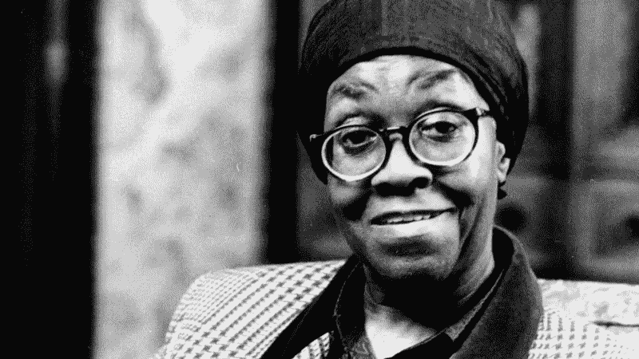

# 格温多林·布鲁克斯:诗歌、贫困和普利策奖

> 原文：<https://medium.com/swlh/gwendolyn-brooks-poetry-poverty-and-a-pulitzer-prize-f3d9463e81b>

Associated Press

## 布鲁克斯教给世界的关于社区和作为美国黑人女性的美丽

格温多林·布鲁克斯是一个朴实、坦率、朴实无华的美国传奇人物。她赢得了包括普利策奖在内的无数奖项，并作为芝加哥第一诗歌夫人而闻名于世。她是个大人物。但是…