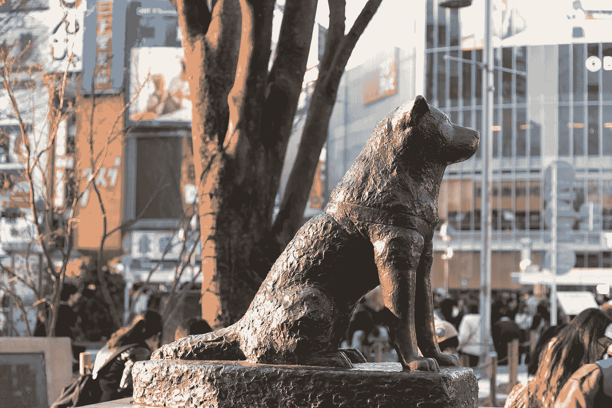

# 八公——关于忠诚和爱情的一课

> 原文：<https://medium.com/swlh/hachiko-a-lesson-about-loyalty-and-love-c65a79fbb74b>

《八公》是根据真实故事改编的日本故事。这是一个关于爱和忠诚的故事——在我们这个崇尚自我的现代社会，这些价值观常常被遗忘。

我第一次在一本日语教科书上读到它。这让我哭了(直到今天我还在哭):八公是一只[秋田犬](https://en.wikipedia.org/wiki/Akita_(dog))，它每天下班后都会在涩谷站附近见到它的主人上野秀三郎…