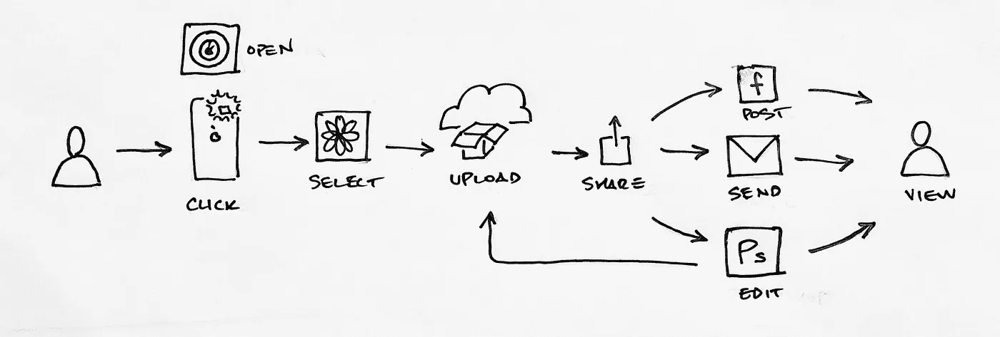
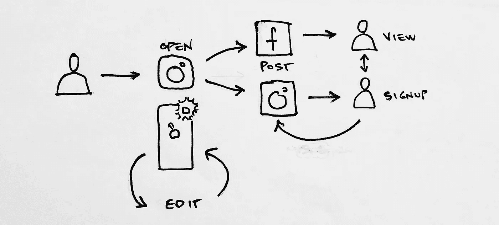
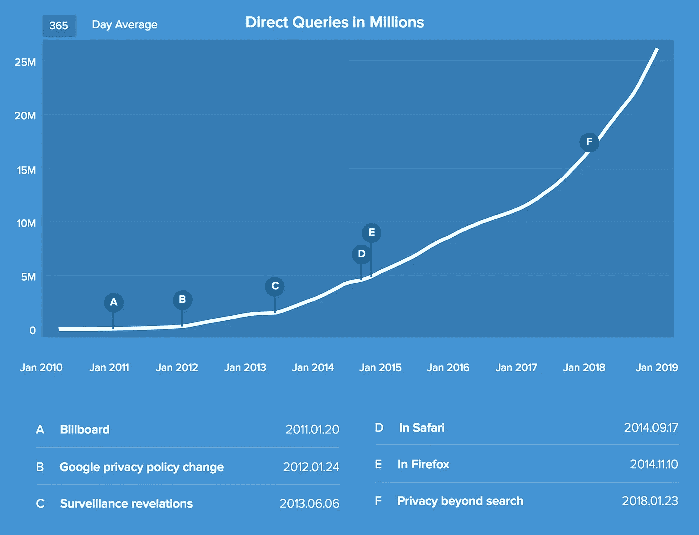

# 黑客、骗局和捆绑:脆弱市场中的强大团队

> 原文：<https://medium.com/swlh/hack-hustle-and-bundle-potent-teams-in-vulnerable-markets-d16f33e8dc9c>

Photo by [Vishal Banik](https://unsplash.com/photos/gS59xG5jzQw?utm_source=unsplash&utm_medium=referral&utm_content=creditCopyText) on [Unsplash](https://unsplash.com/search/photos/stream?utm_source=unsplash&utm_medium=referral&utm_content=creditCopyText)

团队和市场经常被认为是局外人创业成功的两个最重要的因素。这些到底是什么意思？什么样的团队？什么样的市场？

的和[的](/swlh/dont-copy-the-greeks-the-necessary-originality-of-unwelcome-distribution-2fe96bd7bce0)暴发户成功分销的故事都是利用市场现有者的弱点的故事。因此，增长专家被称为黑客是有道理的。

保罗·格拉厄姆在 Web 2.0 时代的开创性巨著《黑客画师》(Hackers & Painters )向 2000 年初的初创企业创始人灌输了黑客精神的重要性。简而言之，黑客行为的核心是[破坏规则](http://www.paulgraham.com/gba.html)。

黑客的标签吸引了程序员的知识，但它的技术内涵掩盖了这样一个事实，即成功渗透市场防御需要的不仅仅是编程能力。它还需要灰色帽子(打破规则)的销售敏锐度，即行骗。

因此，在初创公司格局演变的后期，科技领袖们渴望强调另一种东西的重要性:努力。因为技术黑客——“极具想象力的打破规则”(格雷厄姆)在有形产品中表现出来，hustle，一种通过引导未来的说服表现出来的软技能，更容易被错误识别。

> 不加掩饰的黑客行为是蛮力。没有黑客的攻击是没有弹药的伏击。有了这两者，一个团队就有能力实现伟大。

**有时候，努力和雄心会被混淆。努力工作、雄心勃勃的人通常成就很高，但他们不是通过社会阶梯上的增值交易来获得权力，而是通过取悦当权者来获得更多的权力和回报。换句话说，他们娴熟的说服力让他们被提升到更大的影响力范围，但这些界限仍然是由他们的上级划定的。根据定义，这并不违反规则。**

Hustle 也被误认为是销售成功。销售通常发生在价值链上——一个过程或一系列定义明确、结构化的互动，在这个过程中，获得价值(支付)需要预先支付你应得的份额。在企业销售中，这看起来像潜在买家发出的 RFP(征求建议书),随后是几个小时，跨越几周甚至几个月的评估。不管这一过程是否精心策划，它仍然受到严格控制，沿途设置了大量的税收和通行费。遵守规则是至关重要的。因此，销售成功是 hustle 存在的必要但不充分的指标。

**Hustle 拐弯抹角地看待销售过程。**尽管跳过必要的关卡以避免不合格很重要，但 hustle 在流程的预期界限之外寻找优势。类似于黑客利用 HTML 表单进行缓冲区溢出攻击和 SQL 注入，hustle 挤压社会结构的边界，测试信号开放的非正式性的使用，同时对假设的捷径的缺乏保持怀疑，这是一种在地牢墙壁上放置炸弹的年轻链接。这解释了为什么企业销售发生在鸡尾酒吧和高尔夫球场:交易总是发生在人与人之间，在正式流程之外。Hustle 知道，如果你有的只是形式，你还是一无所有。

这也适用于筹资，因为筹资是企业销售(股权，而不是产品)。一个非正式性击败专业性的很好的例子，看看[陈楚翔](https://medium.com/u/8edc94d7a232?source=post_page-----d16f33e8dc9c--------------------------------)最近在加州一家汉堡店签署的基于餐巾的条款清单:

Just another late night snack run.

请注意，这不是沙盒团队的一个孤立事件，也没有减少将他们的 VR 带入生活所需的黑客攻击。相反，这是一个两者兼而有之的团队的明显症状，这两者的结合是必不可少的:没有 hustle 的黑客是蛮力；没有黑客的攻击是没有弹药的伏击。有了这两者，一个团队就能在市场上取得巨大成功。怎么会？

## 捆绑和拆分

> *做生意赚钱的方式只有两种:一种是捆绑；另一种是非捆绑销售。*
> 
> *—吉姆·巴克斯代尔*

黑客和骗局的双重威胁最适用于有机会捆绑或拆分的市场。捆绑就是融合价值链中的各个环节，以消除摩擦，改善消费者体验。解绑就是将价值链中融合的环节解耦，以创造选择。

**捆绑销售。**以 2010 年用手机发布数码照片的挑战为例。有*是*的一种方式，但是它很难，很乱，而且被苹果/安卓、你的照片应用、Dropbox/GDrive 和脸书管理得很差。价值通过一系列杂乱无章的步骤(价值链)从摄影师流向观众，就像这样:

That’s a lot of loosely-connected steps (i.e. end-to-end tedium).

任何给定链路的 UX 都可能是好的。《皮条客》看到的更重要的战略观察是*没有一家公司拥有端到端的流量。*相反，价值正通过许多不同的手流动，这从涉及的标识数量可以看出。任何时候价值易手，消费者都可以选择——这是预期菊花链中的一个弱点。

有了捆绑销售，这一切都变了。消费者已经把没有给他们的使命增加价值的选择*换成了一种根深蒂固的习惯，即点击 Instagram 图标，嵌入每个功能(甚至是摄像头！).Instagram 已经将以前从左到右级联的无结构混乱的价值转变为一个紧密的事件循环，所有这些都包含在一个单一的堡垒中(脸书公司):*

因为没有一个现任者对端到端的争论有准确的理解，这种捆绑的价值最终远远超过了任何现任者所知道的。这种紧密整合的结果是，发布引人入胜的照片的成本大幅下降。当生产资料变得极其便宜时，价值创造也会激增。看:一只独角兽。

概括地说，当生态系统两个成员之间的价值流动管理不善，即不安全时，捆绑销售机会就会出现。这些价值链中有多家公司在运作，但联系是松散的、模糊的或松散的。如果许多人试图穿越这些笨拙的环节，hustle 间谍有机会打破常规，通过在整个链条上放置套索来重新划定市场的边界。黑客通过提供集成的应用程序体验来实现这一愿景。消费者对沿着旧世界链条采取行动的困难感到沮丧，高兴地放弃选择，涌向新的围墙花园。[1]

**解绑。相比之下，考虑一下谷歌搜索引擎与其广告(AdWords)的捆绑销售。这些都是紧密绑定的，用户没有选择是否参与谷歌的广告业务，与他们的搜索结果分开。**

缺乏对广告引擎的选择看起来不像是一个痛点，但隐私越来越成为一个痛点。为了利用这种被迫失去的保密性，2008 年末， [Gabriel Weinberg](https://medium.com/u/e1a76f1f570?source=post_page-----d16f33e8dc9c--------------------------------) 着手创建 [DuckDuckGo](http://duckduckgo.com) 。与谷歌不同，DuckDuckGo 是“不会跟踪你的搜索引擎。”

DDG 有多成功？这张图表显示了他们自 2010 年以来的上升趋势，以及值得注意的事件注释:

Millions of searches, searches for free. (Credit: [DDG Traffic](https://duckduckgo.com/traffic))

虽然捆绑通常能带来即时满足感(因为用户告别了令人不快的体验)，但分拆通常能以节省的形式带来累积效益:财务、身体或精神上的节省，因为用户会运用他们新发现的选择做出更明智、更健康的决定。图表中的注释——DDG 的增长率得到提升——标志着隐私的价值被媒体强调的时刻。每当这种情况发生时，DDG 对搜索和身份的分拆所带来的选择价值就变得更加明显。

构建一个搜索引擎所需的黑客行为令人印象深刻(轻描淡写)，但加布里埃尔清晰地看到，这种缺乏选择的局面将越来越难以为继。将搜索和身份分开是一个大胆的举动，打破了谷歌已经建立的惯例，即作为搜索引擎的赚钱方式是高度针对性的个性化广告。[2]

## **发现现存漏洞**

如果你是一个缺乏市场洞察力的黑客团队，该怎么办？

对于捆绑销售，寻找双方之间价值转移的步骤不清楚、未映射或未知，并伴有挫折感的地方。这些都是隐藏在众目睽睽之下的固有漏洞。在安全方面，像这样的漏洞有时会通过 [fuzzing](https://el2.convertkit-mail2.com/c/preview/pnceh9hk/aHR0cHM6Ly9lbi53aWtpcGVkaWEub3JnL3dpa2kvRnV6emluZw==) 被发现，fuzzing 是一种渗透测试技术，它利用输入(通过随机性)试图进入系统。通过无指导的游戏，而不是跟随任何明确的迹象，可以发现一个空白，这是有道理的——根本就没有任何迹象。

另一个现成的捆绑线索是:易受攻击的捆绑意味着违反信任。Flickr 和 Google Photos *相信*人们的数码快照会*以某种方式*传到他们的服务中，但是他们低估了移动相机镜头和他们的云之间的跳跃次数，以及这些跳跃在时间上花费了消费者多少。是他们乐意放弃选择的时候了。

对于分拆，寻找你缺乏选择的紧密结合的体验，问问自己为什么，如果你做了会怎样？你会以一种至少模糊可衡量的方式自由受益吗？越容易衡量，非捆绑体验的增长机会就越快。

你现在看到了什么机会？

[*讨论*](https://news.ycombinator.com/item?id=19027263) *关于黑客的新闻。*

*感谢阅读。您可以在 Medium 或 twitter 上关注我，网址为*[*mattwensing*](http://twitter.com/mattwensing)*。*

注意事项:

[1]关于捆绑销售的另一个观点:当捆绑销售成功时，是因为现任者误解了要做的工作。从来不是“给脸书贴张照片”这只是最后一步。这份工作是“在线表达自己”，从打开相机应用程序开始，到在线发布结束。因为这项工作肯定不是“上传到云端”，捆绑的初创公司的收购者通常是价值链最后一步的所有者。虽然不构成破坏性威胁，但初创企业*是*一个有价值的客户获取渠道，比现有企业单枪匹马更早进入价值链。

[2]商业模式组件的捆绑通常是现任者的核心，因此成功的拆分是存在的威胁。因此，如果 DDG 成功了，它很可能不会被谷歌收购，就像物质不能吞噬反物质一样(如果没有非常糟糕的事情发生)。更有可能的情况是，DDG 在很长一段时间内保持独立，或者被某个想用非捆绑产品与谷歌竞争的人收购。

## 这篇文章发表在 [The Startup](https://medium.com/swlh) 上，这是 Medium 最大的创业刊物，拥有+417，678 名读者。

## 在这里订阅接收[我们的头条新闻](http://growthsupply.com/the-startup-newsletter/)。

