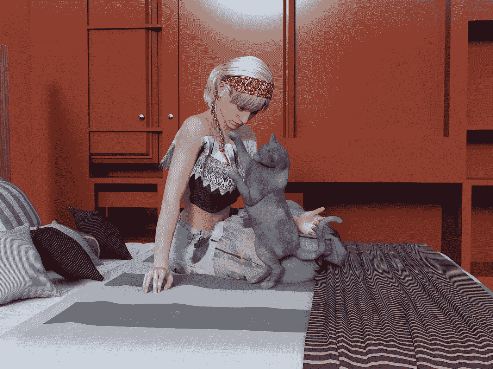

# 发带、猫和智力的本质

> 原文：<https://medium.com/swlh/hair-ties-cats-and-the-nature-of-intelligence-a907f80e6759>

最近的一个晚上，凌晨四点，我的猫决定用爪子戳我的床罩(注意，只有一只爪子伸出来，精确地定位，用极小的力给我的腿造成最大的疼痛),试图叫醒我喂她。很遗憾，她训练有素。我适时下楼，把半罐猫粮倒进她的碗里，然后跌跌撞撞地回到楼上…