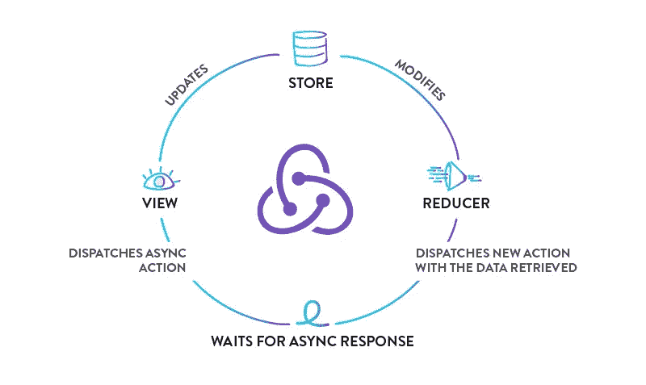

# 用 Redux Thunk 处理异步动作

> 原文：<https://medium.com/swlh/handling-asynchronous-actions-with-redux-thunk-86b8d8e0b83e>

Redux 是一个 JavaScript 库和设计模式，它通过将状态从复杂的组件树中分离出来，鼓励单一的事实来源。这需要一种新的方式来进行异步操作，因为传统的 React 方式包括不断地从生命周期方法(如 componentDidMount)中获取数据来更新组件状态。React 开发人员有三种解决这个问题的一般方法…